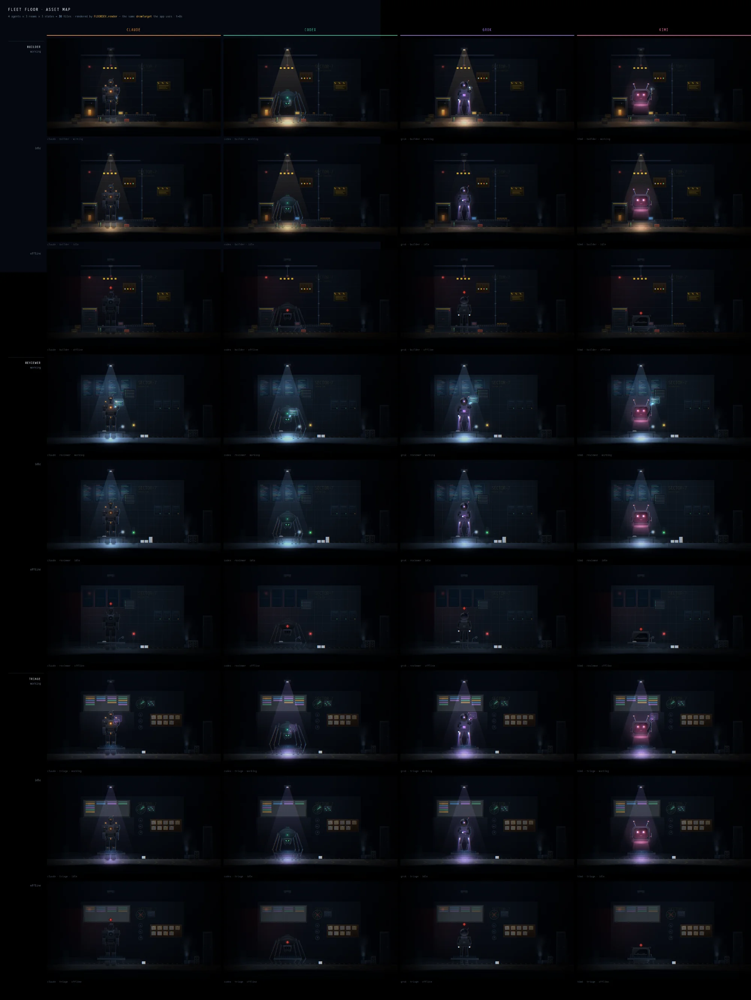

# Asset map

Every robot × every room × every state, rendered by `FLOORDEV.render` — the
same `drawTarget` the app draws its room view with. Regenerate by opening
[`whiteboard.html`](whiteboard.html); see [README](README.md).

Columns are the four units. Rows are grouped by room, then by state.

## Current — after loop 5

*4 agents × 3 rooms × 3 states = 36 tiles, t=8s.*

The per-loop before/afters are in [`LOOPS.md`](LOOPS.md).

## Baseline — before the polish loops

