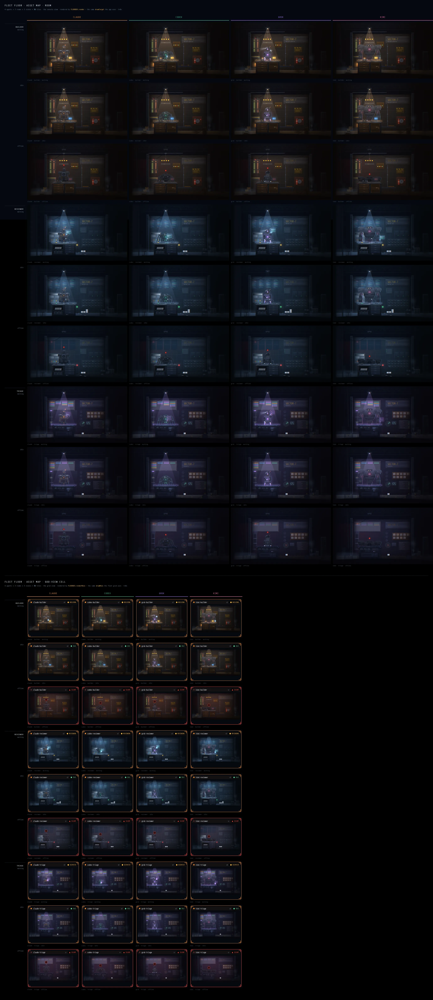
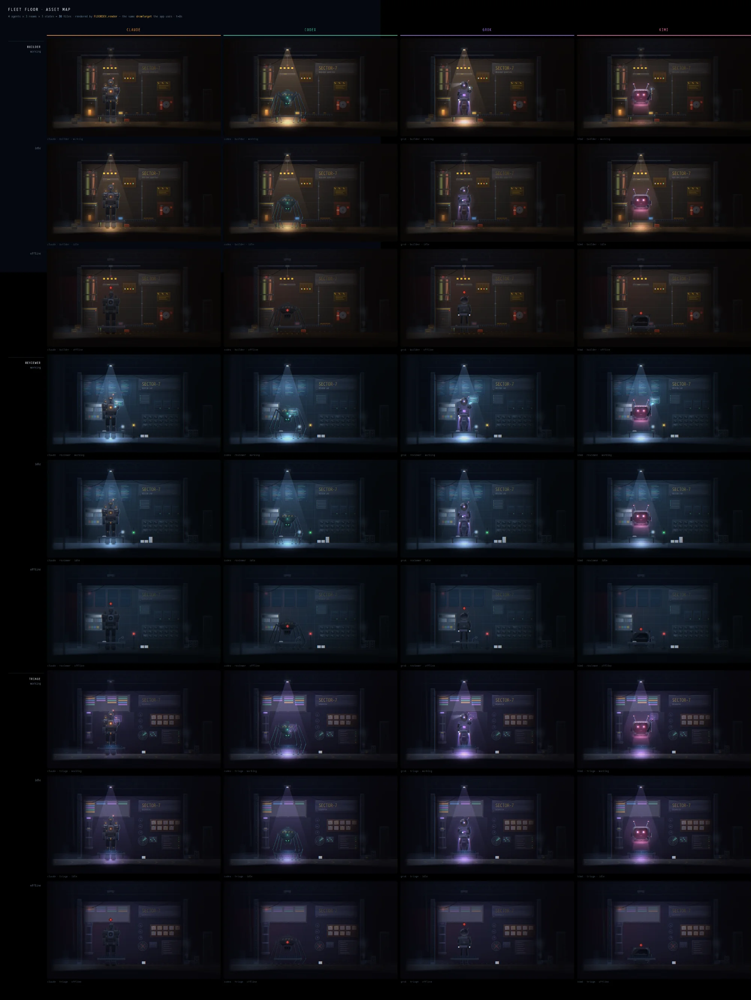
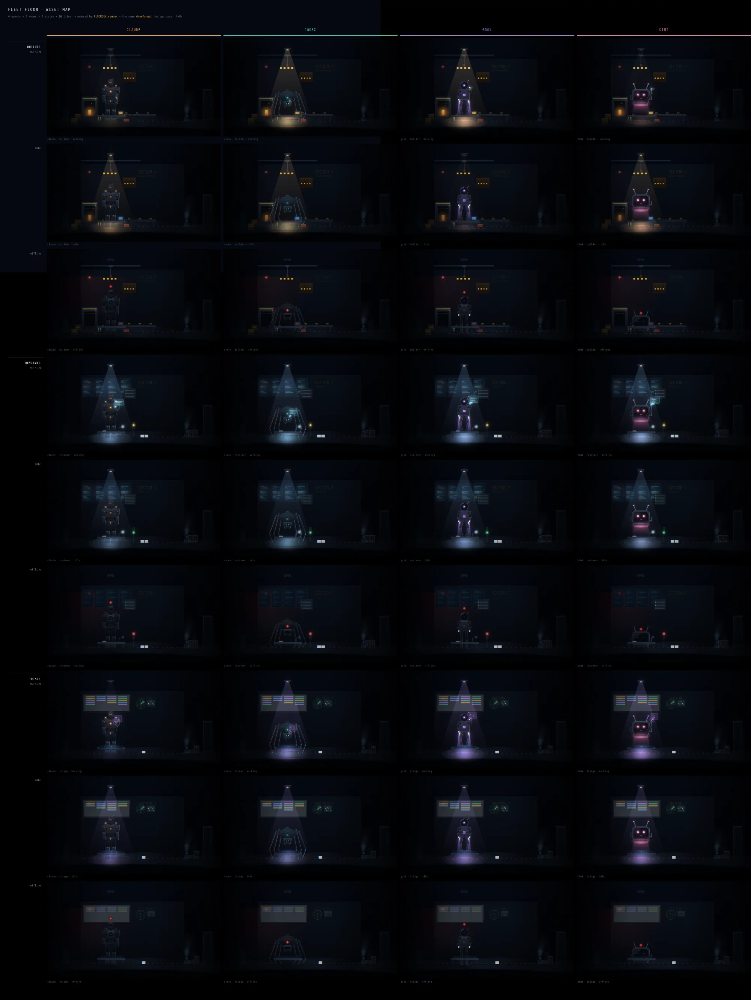

# Asset map

Every robot × every room × every state, twice: once as the console renders it
(`FLOORDEV.render` → `drawTarget`) and once as the god-view grid renders it
(`FLOORDEV.renderMini` → `drawMini`). Regenerate by opening
[`whiteboard.html`](whiteboard.html); see [README](README.md).

Columns are the four units. Rows are grouped by room, then by state.

## Current

*4 agents × 3 rooms × 3 states = 36 tiles, t=8s.*

## After loop 15

The state the fifteen polish loops left it in, before the review pass and the
deck stations.

The per-loop before/afters are in [`LOOPS.md`](LOOPS.md).

## Baseline — before the polish loops

## The god-view cell

The cell's own 36. This map did not exist for the first fifteen loops, which is
why the cell was still drawing a ghost sign and a colliding desk while the room
next to it had been fixed.

Since #226 the cell's portrait is a deterministic still: built at
`strPhase(box)` rather than wall-clock time, through a supersampled
portrait-only sprite trio (`SS = clamp(pw/cropW, 1, 2.6)`) so all four vendors
sample at the same effective density. Two consequences for this map: cell tiles
rendered through `FLOORDEV.renderMini` are **reproducible** for fixed
`(unit, state, size, t)` — diffs between commits are now meaningful at the
pixel level — and portrait sharpness no longer varies with a vendor's crop
width. `FLOORDEV.camstats()` exposes the pipeline's build cost and cache
behavior.

