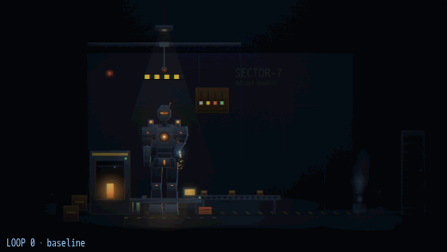
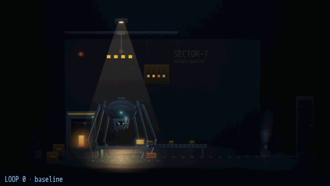
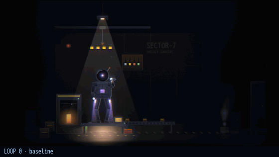
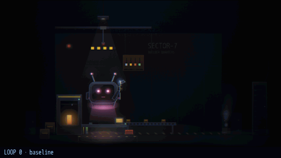
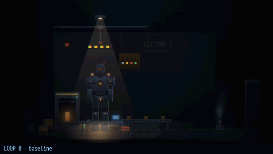
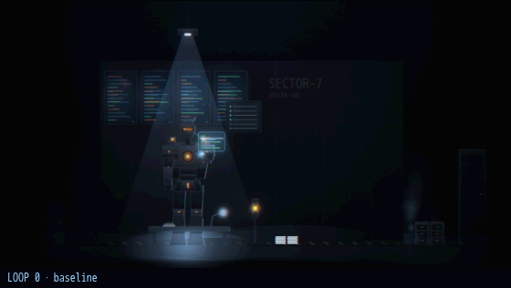
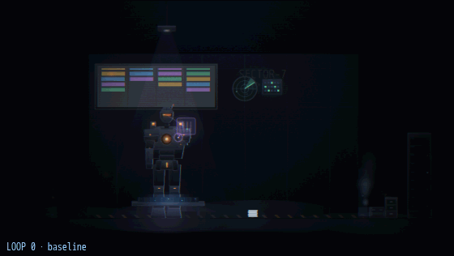
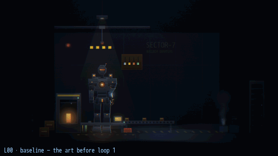
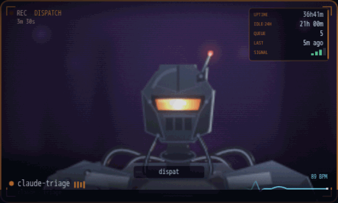
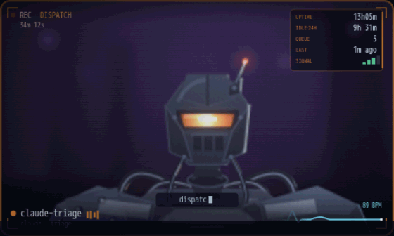

# Fifteen loops, end to end

One animation per robot and per room. **Sixteen frames each** — the baseline,
then every loop in order — rendered from the same seed at the same animation
time, so **the only thing moving between frames is the code**.

Frames hold ~0.85s; the baseline and the final frame hold longer.

> Loop 8 only touched the god-view cell (`drawMini`), so the room frames for
> loops 7 and 8 are identical here. That is correct and worth seeing: it is the
> loop whose whole point was that the grid had fallen behind the room.

## The robots

Shown in the builder bay, working, so the unit is the only variable.

Loops 1–10 are the build: ground contact, a face, offline and idle postures,
light, materials, atmosphere, markings, details. **Loops 11–15 are the five
things that turn a well-drawn unit into a lit one** — structure (11), cavity
occlusion (12), wear (13), joints (14), and a specular tuned to what each one
is actually made of (15). Watch the last five frames on the chest of claude,
the dome of codex, the waist of grok and the crown of kimi.

### claude


### codex


### grok


### kimi


## The rooms

The last five frames are the composition pass, and they read best as a
sequence: the signage becomes an object and the props stop sitting on it (11),
the lamp finally reaches the wall and every prop drops a shadow onto it (12),
the free wall gets named and then furnished (13), a ceiling and a near edge
arrive so the frame has three planes instead of two (14), and the wall stops
ending in a hard cut because it has corners (15).

### builder — the fabrication bay


### reviewer — the review lab


### triage — the dispatch room


## How these were made

`gif.js` in the working set, and it is hand-written, because there was nothing
here to do it with: playwright's bundled ffmpeg is compiled without a gif muxer
or encoder (png, image2 and libvpx only), there is no PIL, and no pip to fetch
one. So the frames are decoded and scaled in a headless canvas, median-cut into
a single global palette, and LZW-packed into a GIF89a by hand.

**One global palette across all sixteen frames, not one per frame.** The whole
point of these is comparing frame N against frame N−1; a per-frame palette
would let the quantiser shift colours between loops and invent differences the
code never made.

> Going from eleven frames to sixteen makes that palette work harder, and loops
> 11–15 are the ones that added colour for it to carry — a lit sign, gas
> bottles, a fire point, a calibration chart. The palette is rebuilt across all
> sixteen rather than extended, so the early frames are re-quantised too: an
> early frame in these files is not byte-identical to the same frame in the
> eleven-frame version. It is the same render, quantised differently.

The per-loop stills and the reasoning are in [`LOOPS.md`](LOOPS.md); the full
36-tile grid is in [`ASSETMAP.md`](ASSETMAP.md).

---

# Baseline to current, in one animation

The files above stop at loop 15, because that is where the work had got to when
they were made. This one does not stop: **forty-three frames, one per commit
that changed the art**, from the tree before loop 1 to `main` after #174.



In order: the baseline, the fifteen polish loops (#142), the three commits of
the review pass that followed them, the three deck-station commits (#174), and
the twenty near-plane loops. Frames hold ~0.6s.

Same subject as [`robot-claude.gif`](#claude) — claude, the builder bay,
working — so the two are directly comparable, and the unit and its room are the
only things that can move.

**Four frames do not move, and that is the animation working.** D08 lands on
the offline station, D11 on codex, D12 and D15 on kimi; none of those is in a
claude-working frame. It is the same shape as loop 8 above — a frame that
repeats is the loop telling you where its change actually was, and the caption
says so.

**The palette works harder here than anywhere else in this file.** One global
256-colour table across forty-three frames of a room lit by two lamps: the rule
that stops the quantiser inventing differences between loops is also what puts
visible banding in the darkest gradients. The sixteen-frame files above do not
show it, and the fix is not a per-frame palette — it is fewer frames or more
light, and neither is worth having.

## The cell cadence fix (#226)

One working tile from the live DEMO floor, 36 frames at ~100ms, before and
after the deterministic-still redesign. Before: the portrait teleports
between breath poses every refresh while the AR overlays animate smoothly on
top — the "broken renderer" read the issue was filed about. After: the
subject moves continuously (sub-pixel composite-time bob), the pose never
jumps, and lag exists only as the occasional performed glitch.

### before — sampled cadence


### after — deterministic still + composite motion


## Rendering any revision

Nothing had to be reconstructed to build this, and nothing will next time:
**every revision from `95b0eff` onward renders itself deterministically.**
`whiteboard.js` has seeded its own PRNG and defaulted to `t=8` since the day the
map was added, so determinism never depended on `seed.js` — which was only split
out of it at loop 8. One recipe therefore spans the whole art history:

```sh
git checkout -f <rev>              # in a detached worktree
fleet-floor/build.sh
# then screenshot canvas[id^="tile-"] from
#   dev/whiteboard.html?view=room&agents=claude&rooms=builder&states=working&w=1280
# once document.body.dataset.wbDone === '1'
```

Two things that will otherwise cost an afternoon: `build.sh` writes **tracked**
files (`index.html`, `dev/whiteboard.html`), so the next checkout needs `-f`;
and the older maps ignore query params they do not know, so `view=` is safe on
revisions from before loop 8 added it.
