# Polish loops

Ten passes over the art. Each pass finds and fixes at least one concrete detail
on **every** robot and **every** room, and every change is rendered before and
after through [the whiteboard](README.md) — same commit, same seed, so the only
thing that moved is the code.

Every fix lands in `src/app.js`. There is one copy of each robot and each room,
so each of these improves the agent console, the god-view thumbnails and the
asset map at the same time.

---

## Loop 1 — ground contact

**The floor did not exist.** Below `FLOORY` the scene was the same `#02040a` as
the void above the wall, so every unit and every prop in all three rooms was
pasted onto a hole. And the thing that should have sold contact — the shadow —
was one soft ellipse pinned at `ROBOX+54` for every walker and `ROBOX` for every
floater. It sat under nothing in particular: 54px to the right of claude's
feet, nowhere near any of codex's six, and it was the same blob whether a unit
was planted on the deck or hanging 60px above it.

Two changes, one per half of the problem.

**A floor, owned by one function.** `floorPlane()` draws the band below
`FLOORY`: a receding plane whose seams converge on the vanishing point the wall
grid already implies, a hard bright lip at the wall join, and a per-room
surface. It runs immediately after `drawBackWall`.

> Finding this took a render that changed nothing. `drawBackWall` — the
> function that draws the **wall** — was also filling the entire floor band
> with a flat gradient and a black seam bar, *after* the first cut of
> `floorPlane` had drawn to it. Everything painted on the floor was silently
> erased. The floor now has exactly one owner.

**Contact shadows from real footprints.** Each robot now reports where it
actually meets the ground, and `drawRobot` draws one shadow per print under the
physical rule: *the higher a foot is above the surface, the wider, softer and
fainter its shadow.* That one line is what makes claude and codex read as heavy
and grok and kimi read as airborne — neither is special-cased.

| unit | reports | reads as |
|---|---|---|
| claude | 2 boots, flat on the deck | planted; two dark cores at the toes |
| codex | 6 tarsus tips | a stance, not a blob — the point of a spider |
| grok | 2 boots, dangling ~60px up | hovering; wide soft prints, no core |
| kimi | 1 skirt, the widest and highest | floating; a single soft pool |

### claude — two boots instead of a blob 54px to its right
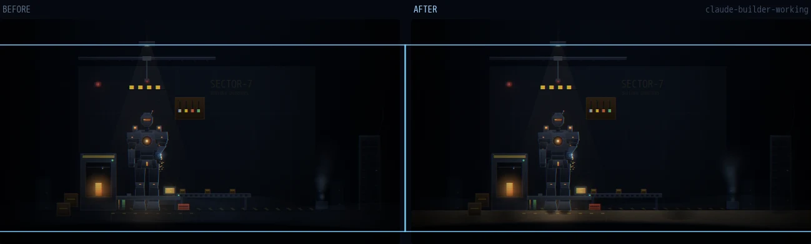

### codex — six feet, so the stance reads
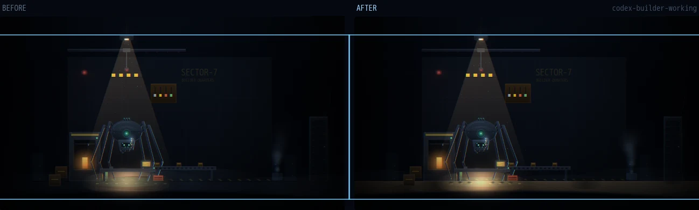

### grok — dangling, so the prints stay soft and coreless
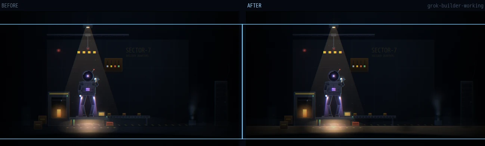

### kimi — one wide pool from the skirt, not two footprints
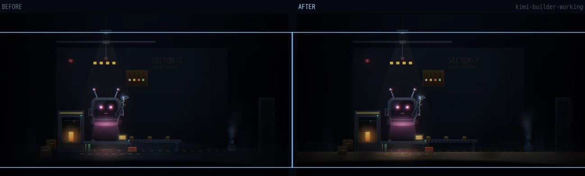

### builder — oil-stained concrete
Stains and scorch, because a fabrication bay floor that is evenly clean is a
rendering and not a workshop. They also sell scale: they are the only thing
down here whose size the eye already knows.

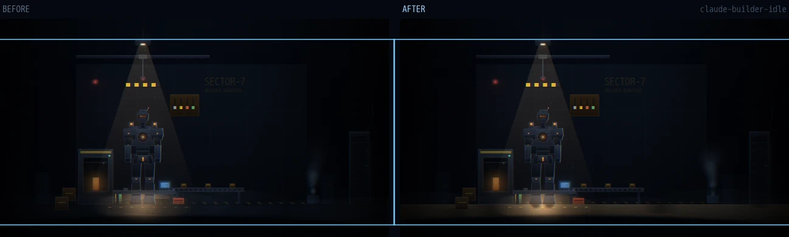

### reviewer — sealed lab floor that reflects
A vertically-squashed echo of the diff wall plus a specular pool under the
lamp. A true mirror would double the noise and read as a bug.

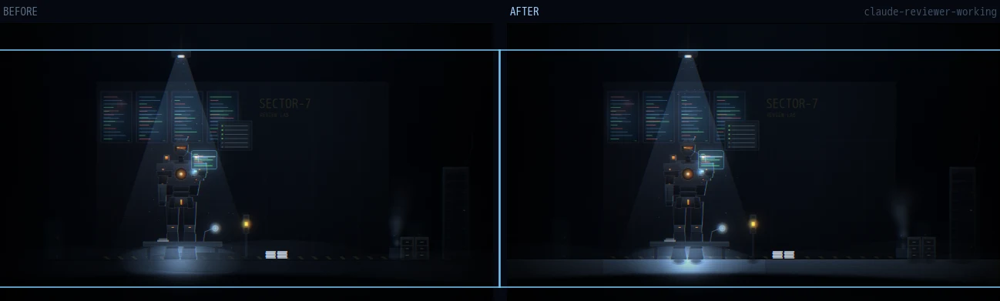

### triage — a painted dispatch lane
Dispatch is about where a thing goes next, so the floor says so. The lane runs
toward the console the triage unit works at.

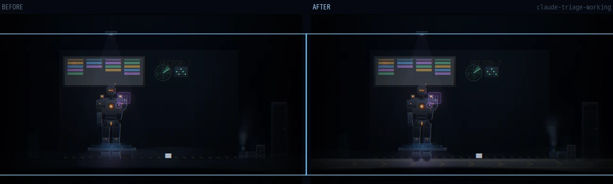

> **The band that is actually visible is `FLOORY..FLOORY+40`.**
> `drawForeground`'s blurred lip rises to about `DH-96` at mid-screen and the
> vignette piles on below it. The first cut painted stains at `+58` and
> chevrons at `+62` — all correct, all invisible. Anything meant to be seen on
> the floor lives in the top 40px of it.

**The map after loop 1:** [`ASSETMAP.md`](ASSETMAP.md)

---

## Loop 2 — identity: faces for the robots, walls for the rooms

Two things were making the fleet look like one thing rendered four ways.

**The robots had no faces.** Each unit's head is the only part of it an operator
looks at, and at grid-cell size it is under 20px tall — it gets exactly one
shape to make an impression with, and all four were spending it on a flat fill.

**The rooms shared a wall.** Three rooms, one wall, one different word painted
on it. The wall is the largest object on screen, and it was saying nothing —
which is most of why the three read as the same room three times. Everything
added here lives right of `x=660`, the dead zone every room had between its
props and the tower.

### claude — depth in the visor
A two-stop gradient across a slit reads as an orange sticker. It now has a brow
shadow casting into the socket (the cheapest depth cue on the model), a hot
core that falls off toward *both* corners instead of sliding left-to-right, a
specular streak that says there is glass in front of it, a dome highlight keyed
to the lamp, and a jaw grille so the lower helmet is not a blank plate.

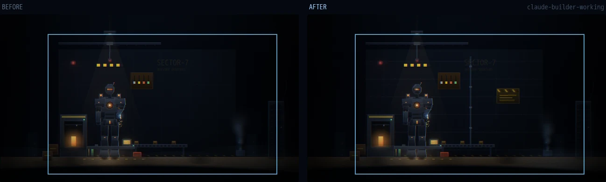

### codex — two eyes that are looking at you
Six equal dots on a flat black rectangle read as a speaker grille, and at cell
size as nothing at all: codex was identified by its silhouette and the reactor
glow, never by a face. A spider that hunts has two dominant forward eyes and a
spread of small ones, so the hierarchy is now explicit — the pair is larger,
recessed into a bevelled socket, and has an iris ring, a dark pupil and a
catchlight. Working, a scan bar crosses each, phase-offset so they feel driven.

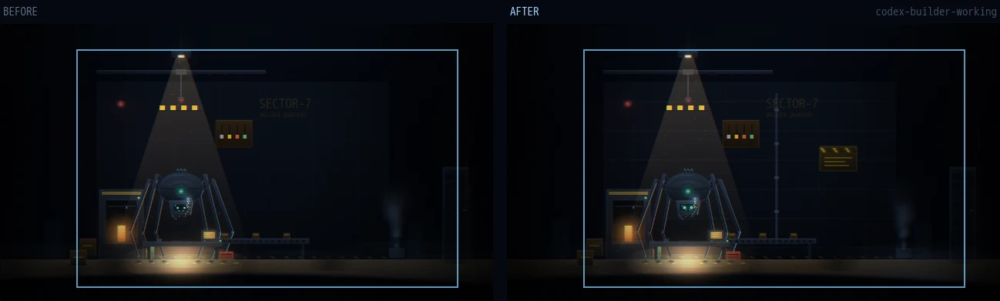

### grok — the dome is a visor, not a hole
A black circle with a starfield and one thin arc. A helmet's job is to show you
the room instead of a face, so it now carries three reflections: a gold flash
coating across the lower dome the way a real EVA visor is coated, the overhead
lamp as a bright cap, and the floor as a dim band along the bottom edge.

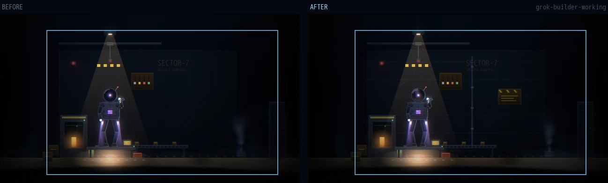

### kimi — glass with a picture behind it
The screen was a flat black rect with a triangular gloss wedge, which reads as
a sticker. It now says the two things that make it a display: the glass is
curved (corners fall off, centre stays open, gloss sweeps instead of wedging),
and the picture is emitted from inside — a pink wash rising up the *inside* of
the glass rather than printed on the front.

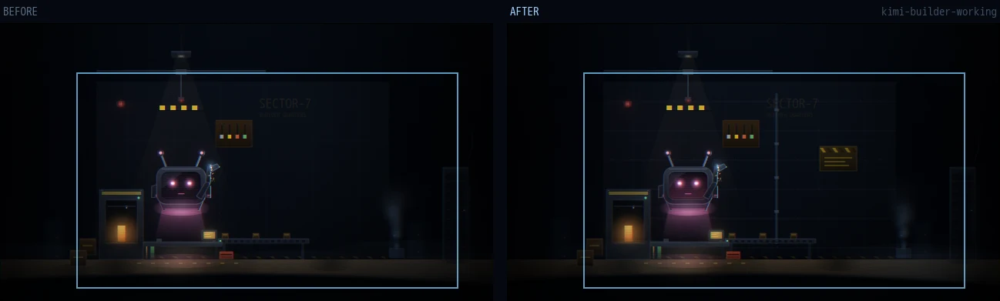

### builder — bolted steel
Horizontal plate seams with rivet rows, a hazard placard, and a conduit run
dropping from the ceiling to the bay.

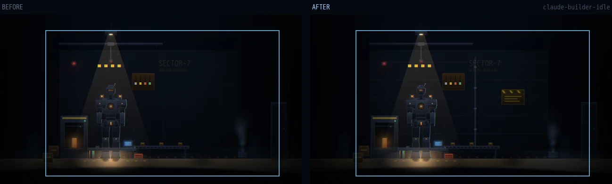

### reviewer — clean-room panels
A fine seam grid, tighter and cooler than the bay's, and a rack of certification
plates: this lab signs what leaves it. Two green stamps and one amber.

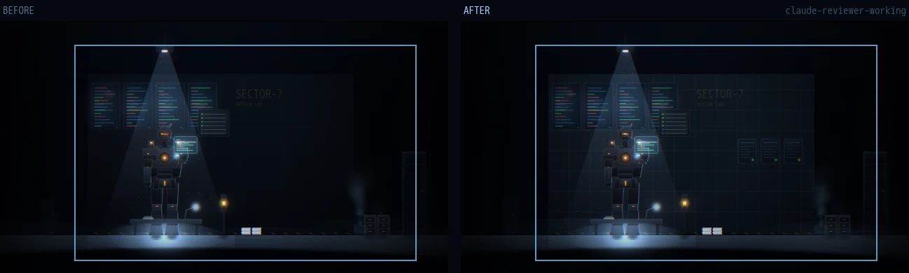

### triage — a board of pinned work orders
A cork strip of pinned slips at slightly different angles, and three zone
clocks — dispatch is about *when*, not only where.

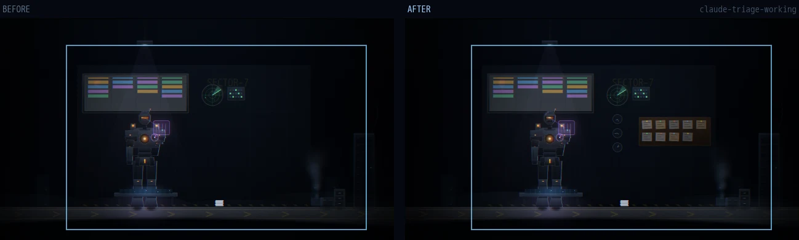

---

## Loop 3 — the offline state

SILENT is the state an operator is scanning the grid *for*, and it was the
least legible thing on the page: every unit was the working model with the
lights switched off, still holding a parade stance, and every room was itself
at lower alpha. Dark is not a shape. On a wall of 36 thumbnails a dimmer copy
of "fine" reads as "fine".

Each unit now has a **posture** and each room a **failure**, not an opacity.

### claude — it drops
The head falls 13px and pitches forward, and the visor keeps one ember at the
left end instead of going flat grey. It is the only warm pixel left on the
unit, so the eye finds it.

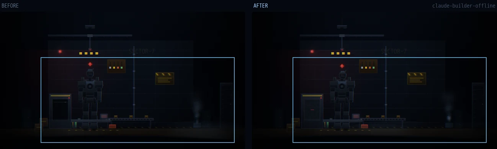

### codex — dead lenses still catch the room
Two red pinpricks in an otherwise black socket, from the room's emergency
beacon. The difference between switched off and simply absent.

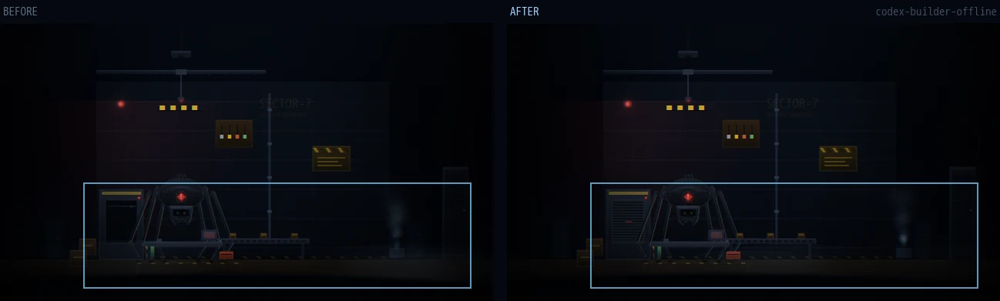

### grok — the hose goes slack
Under power the life-support line is pressurised and holds a tight arc; with
the thrusters dead it hangs. One control point, and it is the clearest "this
suit is not running" tell grok has. The visor also fogs from the inside,
heaviest at the bottom — a window nobody is behind.

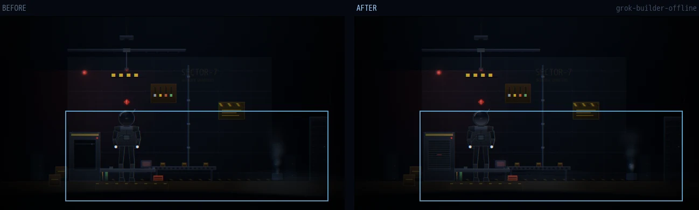

### kimi — no signal, not no power
The ears droop outward and down, and the screen collapses to one bright
horizontal line with a faint residual raster. That line says the panel is
powered enough to be *wrong*, which is exactly what SILENT means.

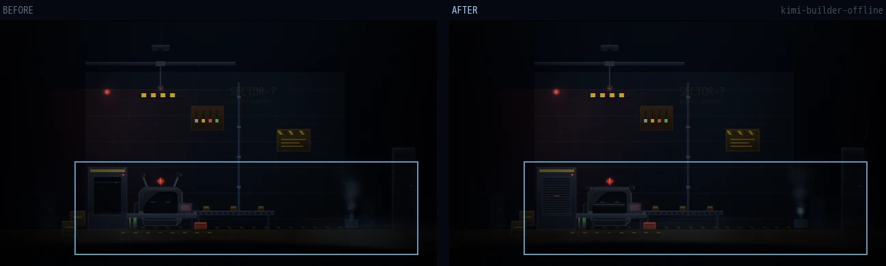

### builder — the bay is shut
A slatted shutter drops over the furnace chamber with a red standby bar. "This
prop is closed" is a different and more useful reading than "this prop is dark".

### reviewer — standby, not a quieter review
The diff monitors were showing the same scrolling code at 0.12 alpha, which
said the review was still running quietly — the opposite of true. They now show
no signal: a centre bar and a lone standby LED.

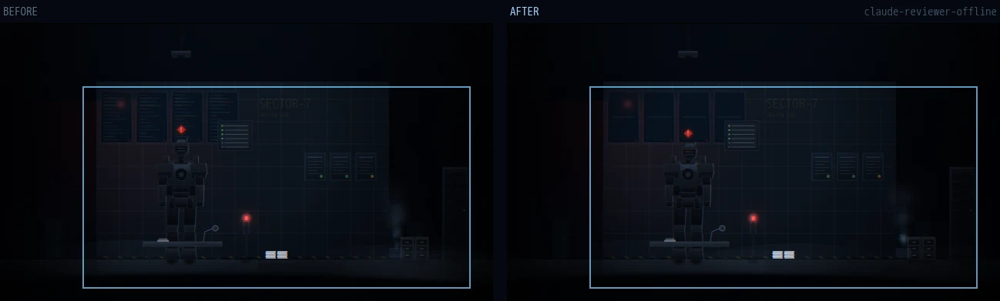

### triage — no link, not no traffic
The radar sweep stopping just looks like a radar with nothing on it, which is a
calm reading of a dead room. A red cross through the trace fixes that.

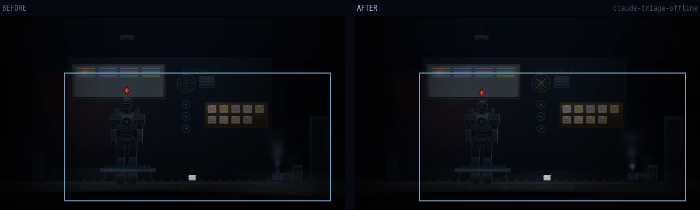

---

## Loop 4 — the idle state

Idle was **working minus the effects**: identical geometry, identical pose, one
fewer hologram. On the grid, "waiting for work" and "doing work" were the same
picture, and for grok idle and *offline* were the same pose too — both hung
their arms, which is what a suit does when nobody is in it.

Idle now means one specific thing everywhere: **awake, and there is work
queued.**

### claude — a standby sweep
A slow bright cell tracks across the visor. Powered, scanning, not engaged —
and it only runs when idle, so the two states can never be confused again.

### codex — it settles
A spider that hunts braces wide; a spider that waits draws in. The footprint
narrows by a fifth and the knees ride lower, which pulls all six contact
shadows in with it for free.

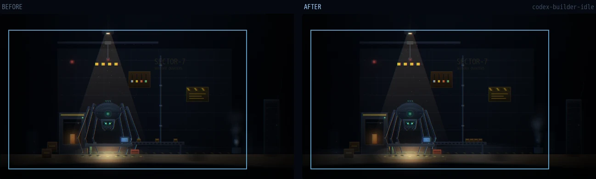

### grok — arms folded
Hanging arms belong to offline. Folded across the chest is unmistakably awake
and waiting, and it separates the two states that used to share a pose.

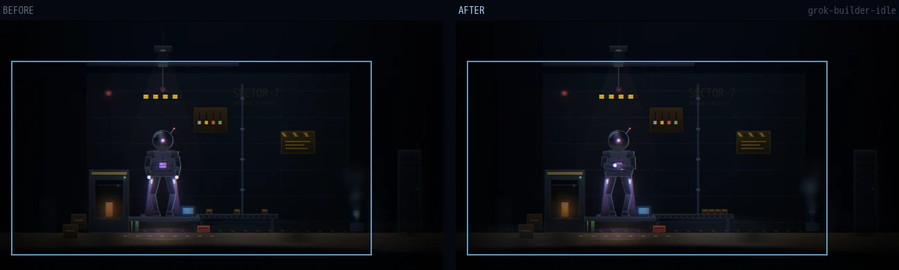

### kimi — the eyes wander
Working, they lock forward. Waiting, they drift on a slow cycle. Kimi's whole
character is two shapes on a screen, so where those shapes point is the only
way it can look busy or look bored.

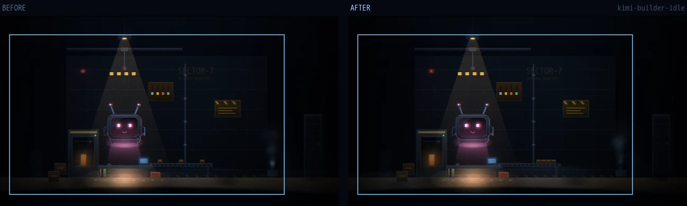

### builder — the belt is backed up
A stopped conveyor is not an empty one. The crates bunch against the head of
the line instead of sitting evenly spaced, so a halted bay reads as *backed up*
rather than merely quiet.

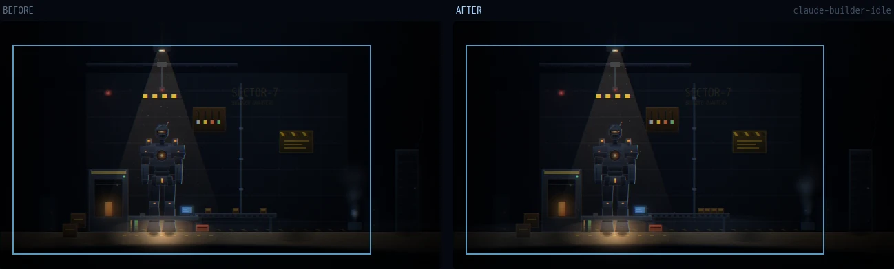

### reviewer — an in-tray appears
Two flat doc stacks said the same thing whether anything was pending or not. A
third, visibly taller pile appears only when nothing is being reviewed.

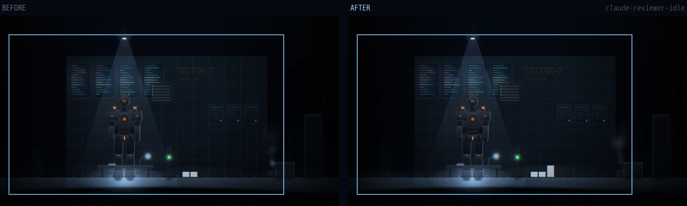

### triage — a backlog, not an empty board
Working, cards spread across all four columns and move. Idle, they pile up five
deep in intake and the other three run to one each. The board is the only thing
in this room that can show a queue.

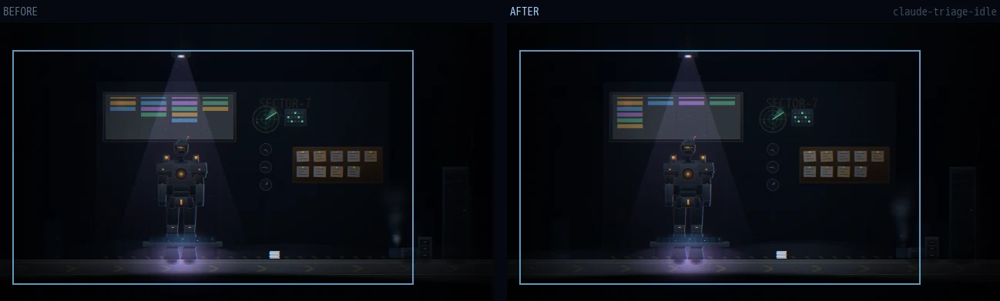
