# Polish loops

Fifteen passes over the art. Loops 1–10 built the rooms and the robots; loops
11–15 were about the picture they are in, after the wall's props were found to
be sitting on top of the wall's own signage. Each pass finds and fixes at least one concrete detail
on **every** robot and **every** room, and every change is rendered before and
after through [the whiteboard](README.md) — same commit, same seed, so the only
thing that moved is the code.

Every fix lands in `src/app.js`. There is one copy of each robot — and, since
[the review pass](#after-the-loops--the-review) below, one copy of each room
too. Fifteen loops ran while that second sentence was false: the god-view cell
was a separate renderer, so wall, sign, lighting and prop fixes reached the
console and stopped there.

---

## Loop 1 — ground contact

**The floor did not exist.** Below `FLOORY` the scene was the same `#02040a` as
the void above the wall, so every unit and every prop in all three rooms was
pasted onto a hole. And the thing that should have sold contact — the shadow —
was one soft ellipse pinned at `ROBOX+54` for every walker and `ROBOX` for every
floater. It sat under nothing in particular: 54px to the right of claude's
feet, nowhere near any of codex's six, and it was the same blob whether a unit
was planted on the deck or hanging 60px above it.

Two changes, one per half of the problem.

**A floor, owned by one function.** `floorPlane()` draws the band below
`FLOORY`: a receding plane whose seams converge on the vanishing point the wall
grid already implies, a hard bright lip at the wall join, and a per-room
surface. It runs immediately after `drawBackWall`.

> Finding this took a render that changed nothing. `drawBackWall` — the
> function that draws the **wall** — was also filling the entire floor band
> with a flat gradient and a black seam bar, *after* the first cut of
> `floorPlane` had drawn to it. Everything painted on the floor was silently
> erased. The floor now has exactly one owner.

**Contact shadows from real footprints.** Each robot now reports where it
actually meets the ground, and `drawRobot` draws one shadow per print under the
physical rule: *the higher a foot is above the surface, the wider, softer and
fainter its shadow.* That one line is what makes claude and codex read as heavy
and grok and kimi read as airborne — neither is special-cased.

| unit | reports | reads as |
|---|---|---|
| claude | 2 boots, flat on the deck | planted; two dark cores at the toes |
| codex | 6 tarsus tips | a stance, not a blob — the point of a spider |
| grok | 2 boots, dangling ~60px up | hovering; wide soft prints, no core |
| kimi | 1 skirt, the widest and highest | floating; a single soft pool |

### claude — two boots instead of a blob 54px to its right


### codex — six feet, so the stance reads


### grok — dangling, so the prints stay soft and coreless


### kimi — one wide pool from the skirt, not two footprints


### builder — oil-stained concrete
Stains and scorch, because a fabrication bay floor that is evenly clean is a
rendering and not a workshop. They also sell scale: they are the only thing
down here whose size the eye already knows.


### reviewer — sealed lab floor that reflects
A vertically-squashed echo of the diff wall plus a specular pool under the
lamp. A true mirror would double the noise and read as a bug.


### triage — a painted dispatch lane
Dispatch is about where a thing goes next, so the floor says so. The lane runs
toward the console the triage unit works at.


> **The band that is actually visible is `FLOORY..FLOORY+40`.**
> `drawForeground`'s blurred lip rises to about `DH-96` at mid-screen and the
> vignette piles on below it. The first cut painted stains at `+58` and
> chevrons at `+62` — all correct, all invisible. Anything meant to be seen on
> the floor lives in the top 40px of it.

**The map after loop 1:** [`ASSETMAP.md`](ASSETMAP.md)

---

## Loop 2 — identity: faces for the robots, walls for the rooms

Two things were making the fleet look like one thing rendered four ways.

**The robots had no faces.** Each unit's head is the only part of it an operator
looks at, and at grid-cell size it is under 20px tall — it gets exactly one
shape to make an impression with, and all four were spending it on a flat fill.

**The rooms shared a wall.** Three rooms, one wall, one different word painted
on it. The wall is the largest object on screen, and it was saying nothing —
which is most of why the three read as the same room three times. Everything
added here lives right of `x=660`, the dead zone every room had between its
props and the tower.

### claude — depth in the visor
A two-stop gradient across a slit reads as an orange sticker. It now has a brow
shadow casting into the socket (the cheapest depth cue on the model), a hot
core that falls off toward *both* corners instead of sliding left-to-right, a
specular streak that says there is glass in front of it, a dome highlight keyed
to the lamp, and a jaw grille so the lower helmet is not a blank plate.


### codex — two eyes that are looking at you
Six equal dots on a flat black rectangle read as a speaker grille, and at cell
size as nothing at all: codex was identified by its silhouette and the reactor
glow, never by a face. A spider that hunts has two dominant forward eyes and a
spread of small ones, so the hierarchy is now explicit — the pair is larger,
recessed into a bevelled socket, and has an iris ring, a dark pupil and a
catchlight. Working, a scan bar crosses each, phase-offset so they feel driven.


### grok — the dome is a visor, not a hole
A black circle with a starfield and one thin arc. A helmet's job is to show you
the room instead of a face, so it now carries three reflections: a gold flash
coating across the lower dome the way a real EVA visor is coated, the overhead
lamp as a bright cap, and the floor as a dim band along the bottom edge.


### kimi — glass with a picture behind it
The screen was a flat black rect with a triangular gloss wedge, which reads as
a sticker. It now says the two things that make it a display: the glass is
curved (corners fall off, centre stays open, gloss sweeps instead of wedging),
and the picture is emitted from inside — a pink wash rising up the *inside* of
the glass rather than printed on the front.


### builder — bolted steel
Horizontal plate seams with rivet rows, a hazard placard, and a conduit run
dropping from the ceiling to the bay.


### reviewer — clean-room panels
A fine seam grid, tighter and cooler than the bay's, and a rack of certification
plates: this lab signs what leaves it. Two green stamps and one amber.


### triage — a board of pinned work orders
A cork strip of pinned slips at slightly different angles, and three zone
clocks — dispatch is about *when*, not only where.


---

## Loop 3 — the offline state

SILENT is the state an operator is scanning the grid *for*, and it was the
least legible thing on the page: every unit was the working model with the
lights switched off, still holding a parade stance, and every room was itself
at lower alpha. Dark is not a shape. On a wall of 36 thumbnails a dimmer copy
of "fine" reads as "fine".

Each unit now has a **posture** and each room a **failure**, not an opacity.

### claude — it drops
The head falls 13px and pitches forward, and the visor keeps one ember at the
left end instead of going flat grey. It is the only warm pixel left on the
unit, so the eye finds it.


### codex — dead lenses still catch the room
Two red pinpricks in an otherwise black socket, from the room's emergency
beacon. The difference between switched off and simply absent.


### grok — the hose goes slack
Under power the life-support line is pressurised and holds a tight arc; with
the thrusters dead it hangs. One control point, and it is the clearest "this
suit is not running" tell grok has. The visor also fogs from the inside,
heaviest at the bottom — a window nobody is behind.


### kimi — no signal, not no power
The ears droop outward and down, and the screen collapses to one bright
horizontal line with a faint residual raster. That line says the panel is
powered enough to be *wrong*, which is exactly what SILENT means.


### builder — the bay is shut
A slatted shutter drops over the furnace chamber with a red standby bar. "This
prop is closed" is a different and more useful reading than "this prop is dark".


### reviewer — standby, not a quieter review
The diff monitors were showing the same scrolling code at 0.12 alpha, which
said the review was still running quietly — the opposite of true. They now show
no signal: a centre bar and a lone standby LED.


### triage — no link, not no traffic
The radar sweep stopping just looks like a radar with nothing on it, which is a
calm reading of a dead room. A red cross through the trace fixes that.


---

## Loop 4 — the idle state

Idle was **working minus the effects**: identical geometry, identical pose, one
fewer hologram. On the grid, "waiting for work" and "doing work" were the same
picture, and for grok idle and *offline* were the same pose too — both hung
their arms, which is what a suit does when nobody is in it.

Idle now means one specific thing everywhere: **awake, and there is work
queued.**

### claude — a standby sweep
A slow bright cell tracks across the visor. Powered, scanning, not engaged —
and it only runs when idle, so the two states can never be confused again.


### codex — it settles
A spider that hunts braces wide; a spider that waits draws in. The footprint
narrows by a fifth and the knees ride lower, which pulls all six contact
shadows in with it for free.


### grok — arms folded
Hanging arms belong to offline. Folded across the chest is unmistakably awake
and waiting, and it separates the two states that used to share a pose.


### kimi — the eyes wander
Working, they lock forward. Waiting, they drift on a slow cycle. Kimi's whole
character is two shapes on a screen, so where those shapes point is the only
way it can look busy or look bored.


### builder — the belt is backed up
A stopped conveyor is not an empty one. The crates bunch against the head of
the line instead of sitting evenly spaced, so a halted bay reads as *backed up*
rather than merely quiet.


### reviewer — an in-tray appears
Two flat doc stacks said the same thing whether anything was pending or not. A
third, visibly taller pile appears only when nothing is being reviewed.


### triage — a backlog, not an empty board
Working, cards spread across all four columns and move. Idle, they pile up five
deep in intake and the other three run to one each. The board is the only thing
in this room that can show a queue.


---

## Loop 5 — light that lands

Every emissive in this scene glowed into the bloom buffer and then **lit
nothing**. A reactor bright enough to read across a room, set in plate armour
that stayed the same colour as the shins. A welding arc — the brightest thing
in the building — illuminating a 20px bubble and not the deck under it. Four lit
monitors bolted to a wall as black as the unlit half of the room.

One rule, applied seven times: **a light source has to land on a surface.**

The washes are additive on the *body* layer, not the emissive one — this is
light arriving on the plates, not more glow leaving them.

### claude — the core lights its own chest
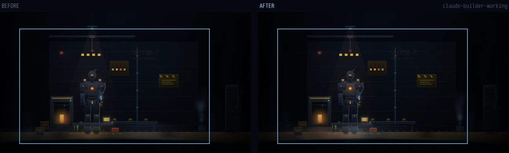

### codex — teal falls on the carapace above and the head plate below
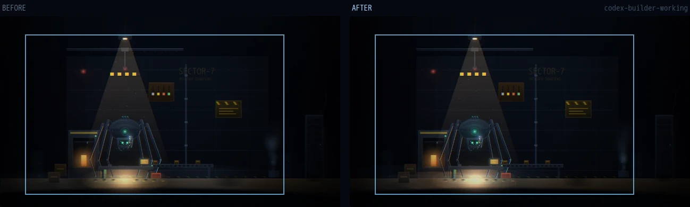

### grok — the chest readout lights the suit, and now the folded arms in front of it
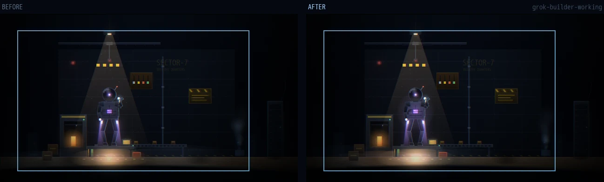

### kimi — the screen lights its own housing
The brightest thing in kimi's frame, and the casing, the ear stalks and the
skirt all stayed the same grey they are in the dark.

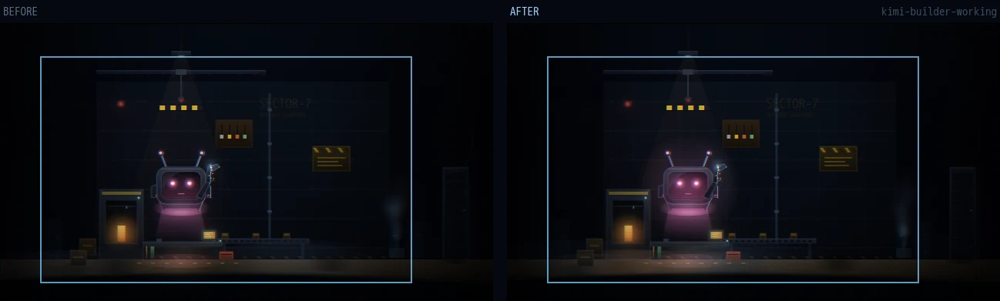

### builder — the furnace throws on the floor, and the weld arc throws harder
The bay's brightest object with concrete two feet away as dark as the far
corner. The arc's flickering floor pool is also what sells the sparks as hot
rather than as orange confetti.

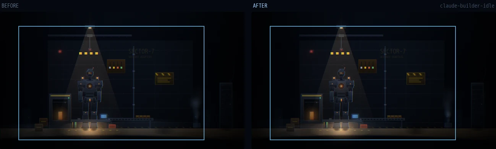

### reviewer — the diff wall lights the wall it is bolted to
This is what stopped it reading as a poster of monitors.

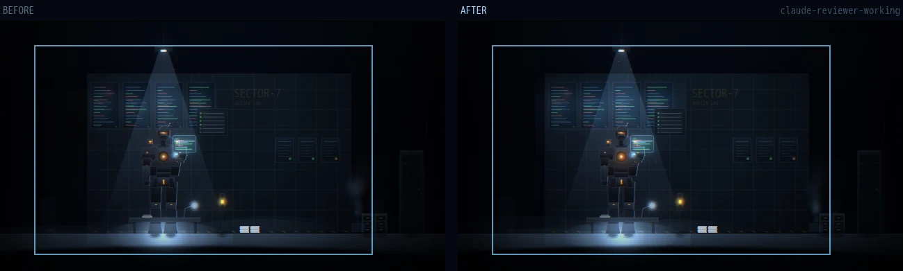

### triage — the board spills downward, colourless on purpose
The other two rooms take their light source's hue. This one does not: the
board's colours are its *data*, and tinting the room with them would make the
wall look like it meant something.

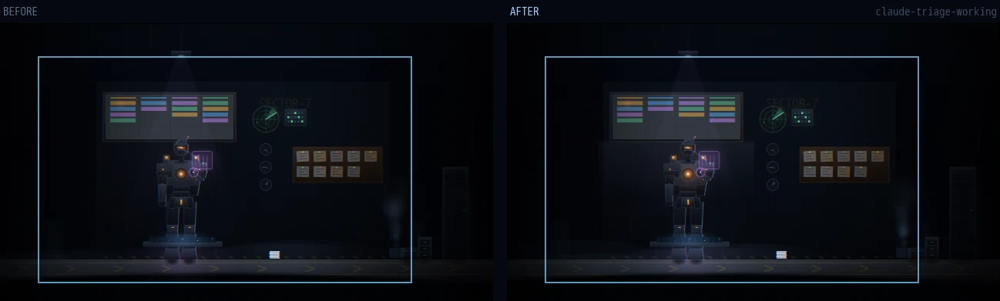

---

## Loop 6 — materials, and a marking on every unit

Every plate in the fleet was a two-stop vertical gradient meeting its neighbour
at a perfectly clean line. Four units built from four different materials —
armour, machined shell, pressure fabric, moulded plastic — all rendering with
identical bevels, and none of them carrying so much as a serial.

**Markings are geometric, not text.** At grid-cell size claude's chest is about
12px across; a glyph is mush, but a stencil *block* still reads as a marking.

### claude — stencil and worn edges
A fleet vehicle carries its designation. The paint also goes first along the
top lip of each big plate, which is what stops a heavy mech reading as a
rendered solid rather than something assembled out of parts that get knocked
about.

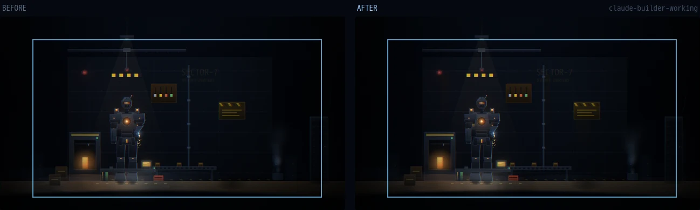

### codex — brushed metal
The carapace is the largest single shape codex has and it was perfectly smooth,
which is the one surface quality a machined shell never has. Anisotropic
streaks following the curve give it a grain, and the grain is what says *metal*
rather than plastic or paint.

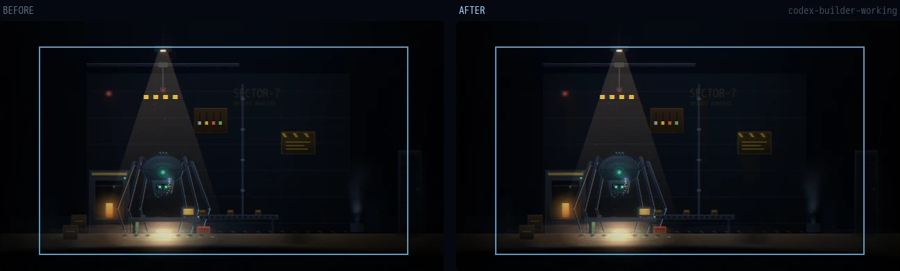

### grok — fabric, and a mission patch
A pressure suit should be the one soft-looking unit in the fleet and it was
rendering with the mech's hard bevels. Quilted seams give the torso cloth's
structure; the shoulder patch is grok's marking, and the only round shape on a
body otherwise made of boxes.

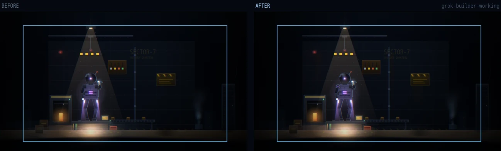

### kimi — moulded plastic
A broad soft specular across the top of the casing — what plastic does and
brushed steel does not — plus a decal band on the skirt, the counterpart to
claude's stencil and grok's patch.

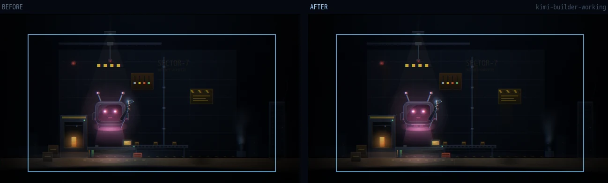

### builder — grime under every fixture
A workshop wall stains beneath whatever is bolted to it. A perfectly clean one
is the giveaway that this is geometry rather than a place where work happens.

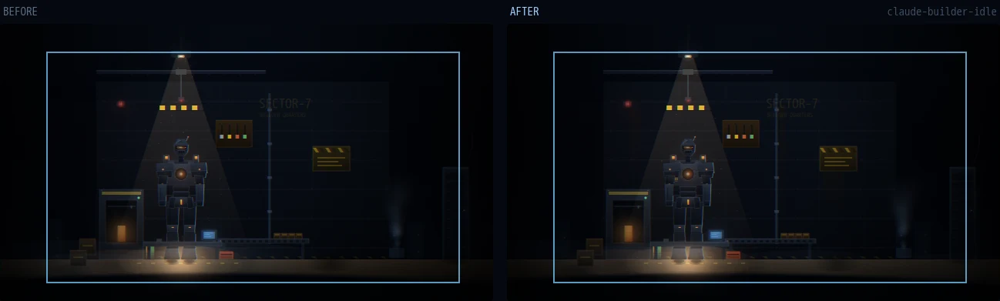

### reviewer — coved skirting and a cable tray
The room whose surfaces have to read as *finished*. A curved wall-to-floor cove
— no corner to trap contamination — and a high-level tray carrying the monitor
runs, rather than four screens fed by nothing.

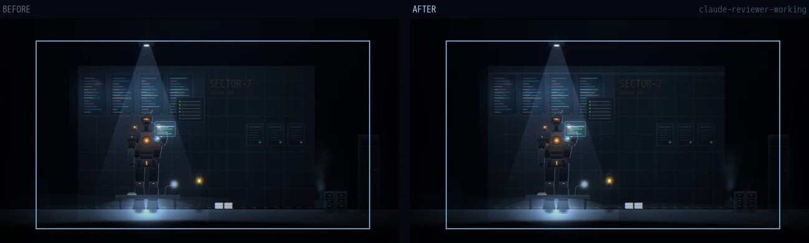

### triage — chipped frame
The one object in the fleet touched by hand all day: cards pinned, moved,
pulled. It was rendering as factory-fresh extruded aluminium. The paint goes at
the corners and along the bottom rail where hands rest.

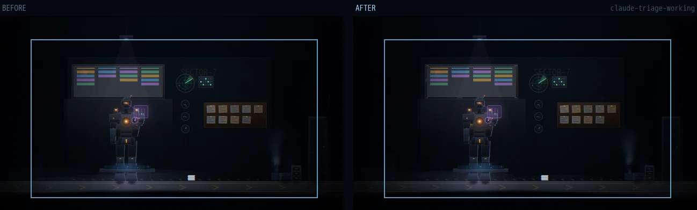

---

## Loop 7 — atmosphere

Two things were missing, and both are about the unit and the room occupying the
same space rather than being stacked as layers.

**Nothing touched the air.** All four of these move a lot of energy, and the
room already had drifting fog and rising steam of its own — the robot simply
stood in front of it as a cut-out.

**Nothing was in front of the camera.** Wall, props, robot: one focal distance,
so the frame had depth behind the subject and none ahead of it. One blurred
object close to the lens does more for the sense of a real space than anything
that can be added at the back.

### claude — heat shimmer off the exhaust stacks
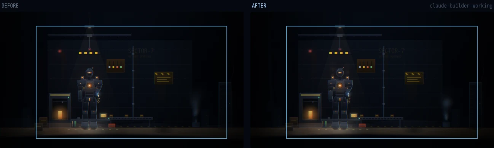

### codex — dust standing at all six feet
A heavy thing that has just settled. It reads off the same footprints the
contact shadows use, so the dust is always where the feet are.

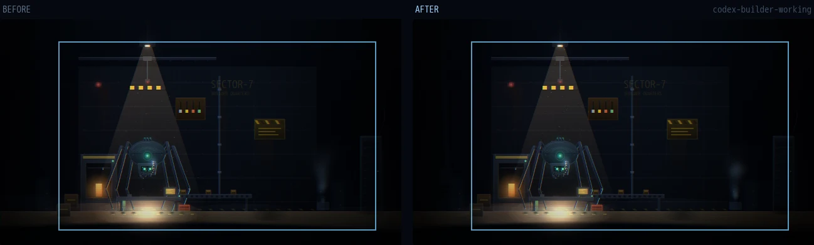

### grok — thrust hitting the deck and spilling sideways
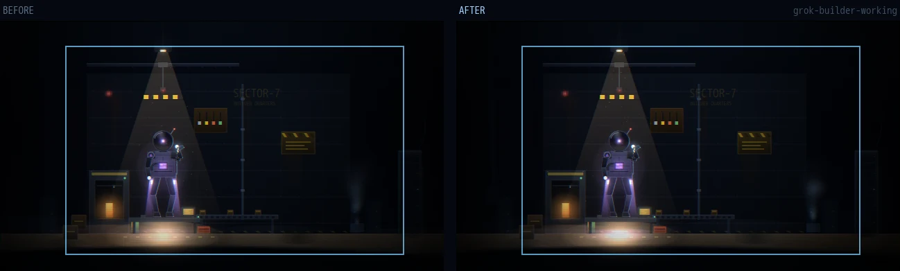

### kimi — the hover skirt rings the floor
Rings travel outward and fade. Kimi is the only unit with no contact at all, so
it gets the only disturbance that is purely downward pressure.

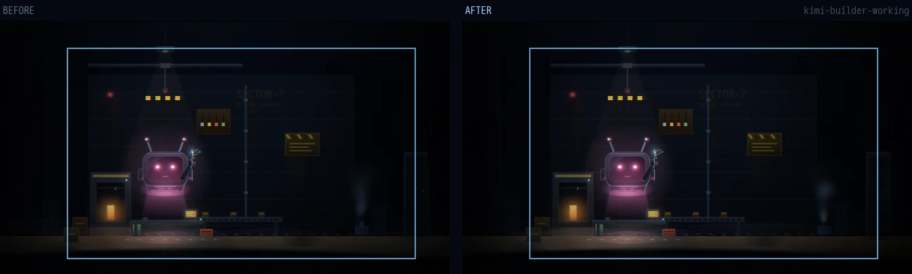

### builder — a chain hoist off-camera-left, a girder crossing top-right
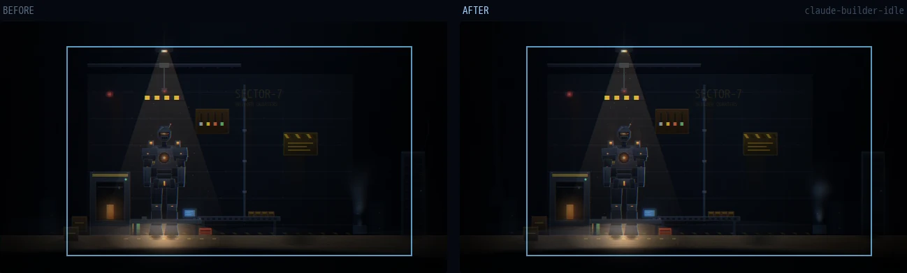

### reviewer — the edge of a glass partition
The camera is looking *through* something. Right for the room that is sealed.

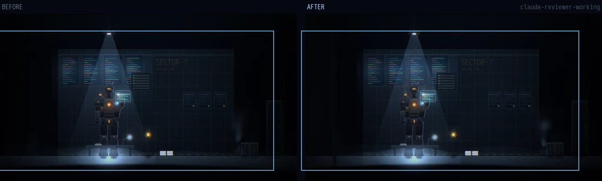

### triage — a cable bundle dropping past the lens
The way a dispatch room is actually wired.

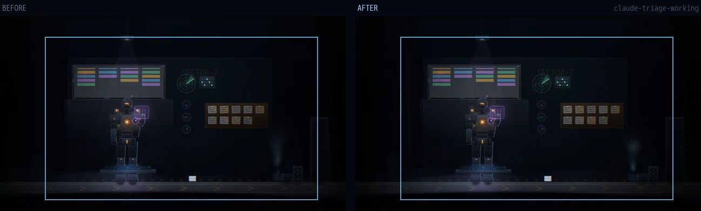

---

## Loop 8 — the grid cell catches up

Seven loops of work had gone into the **room** view. The **god-view cell** had
received none of it — and the god-view is the default view, the one an operator
actually scans.

`drawMini` is a deliberate LOD: its own simplified diorama, not a scaled copy of
the room. That is the right call, and it is also how it drifted seven loops
behind without anyone noticing.

Two things it was missing, both from loop 1:

**No contact shadows at all.** Not a wrong shadow — *none*. All four units
floated in every cell. They now use the same footprints and the same
height-based softening rule the room uses, read off `lastFeet`, so claude and
codex plant and grok and kimi hover here too, instead of all four being equally
weightless.

**A flat black floor**, `#04070d` with a black bar — exactly what the room had
before loop 1 gave it a surface. The three room treatments now exist at cell
scale: stained concrete, a reflective sealed floor, a painted dispatch lane.

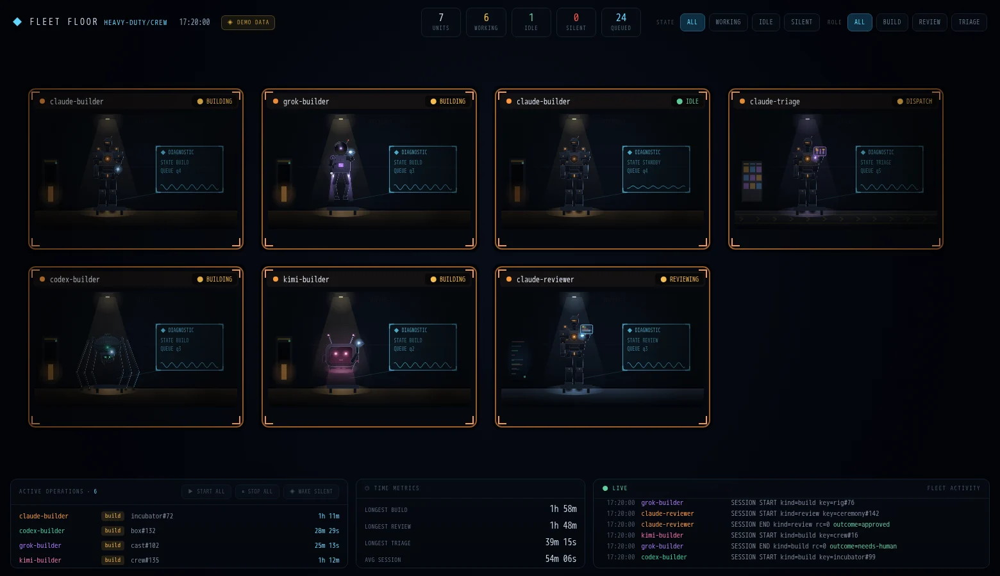

### claude · codex — planted, with dark cores at the contact points
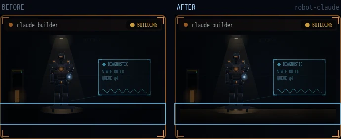
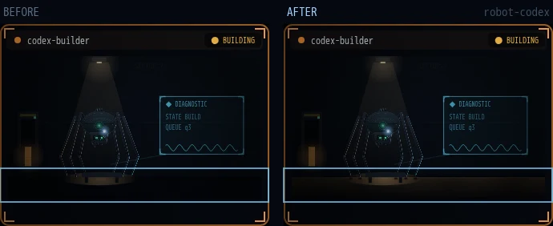

### grok · kimi — wide, soft, coreless: airborne
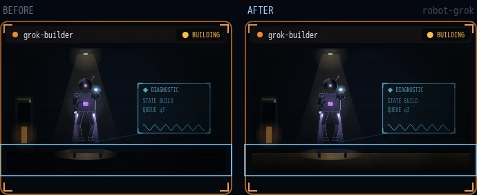
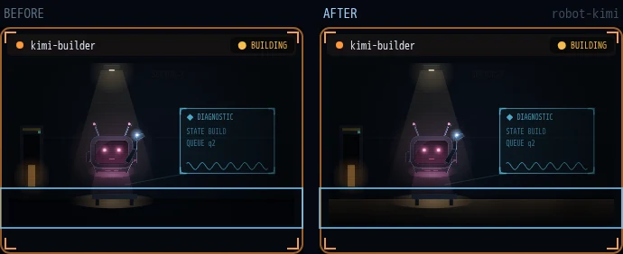

### builder · reviewer · triage — the floor treatments, at cell scale
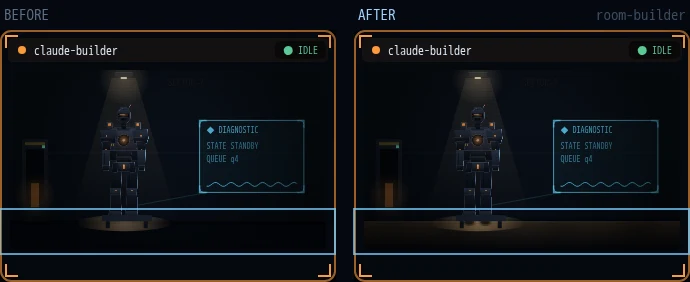
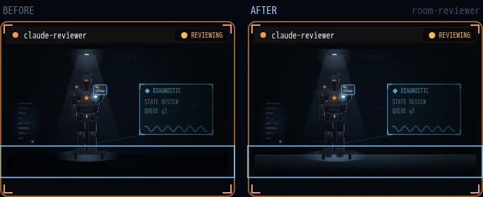
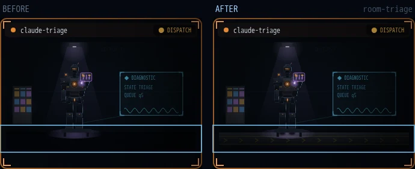

### And a real bug, found by this loop

Loop 8 should not have been able to change the **room** renderer at all — it only
touched `drawMini`. The asset map disagreed: all 36 tiles moved by ~1.8%,
uniformly.

They were right and I was wrong about what "deterministic" covered.
`whiteboard.js` installed its seeded PRNG itself — but it is a separate
`<script>`, so it necessarily ran **after** `app.js`, and `app.js` fixes four
things at module load:

| built at load | used |
|---|---|
| `noise` | a 220×220 film-grain texture composited into **every** frame |
| `motes` | 90 dust particles |
| `steam` | 26 vent puffs |
| `floorHaze` | 5 drifting fog bodies |

All four came from the real `Math.random` and differed on every page load. The
per-tile seeding underneath was working perfectly, behind a grain texture that
was never the same twice.

The PRNG now lives in [`dev/seed.js`](seed.js) and `build.sh` inlines it
**before** `app.js`. Two renders of one commit are now byte-identical: **0 of 37
images differ**, where it had been 37 of 37.

The ~1.8% noise floor never produced a wrong conclusion here — every loop's real
change came in between 2.4% and 31% — but it is exactly the floor that would
have swallowed a small one, and the claim has to be true or the method is
decoration. `floorshot.js`, which drives the grid, injects its PRNG through
`addInitScript` and so runs before any page script: it was correct from the
start, and is verified so.

---

## Loop 9 — vendor colour as structure, and a grade per room

Two places where four things and three things were sharing one thing.

### The rim light was one gradient for all four units

The rim — the bright hairline down each unit's edges — is the single biggest
thing separating a robot from the room behind it, and it was **warm on the
left, cyan on the right, for everybody**. Which meant the fleet's four vendor
colours lived only in lights and screens: swap a claude for a kimi and the
outline of the thing was identical.

The key side now carries the vendor's own colour and the fill side keeps the
room's cool bounce. Each unit is identifiable from its edge alone — which is
the only part of it that survives at grid-cell size.

| | key-side rim |
|---|---|
| claude | `255,170,90` orange |
| codex | `55,212,166` teal |
| grok | `176,124,255` violet |
| kimi | `255,114,182` pink |

Offline desaturates the rim too, rather than switching it off: a dead unit
still has edges.

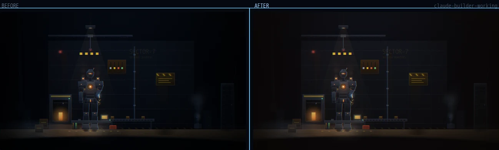
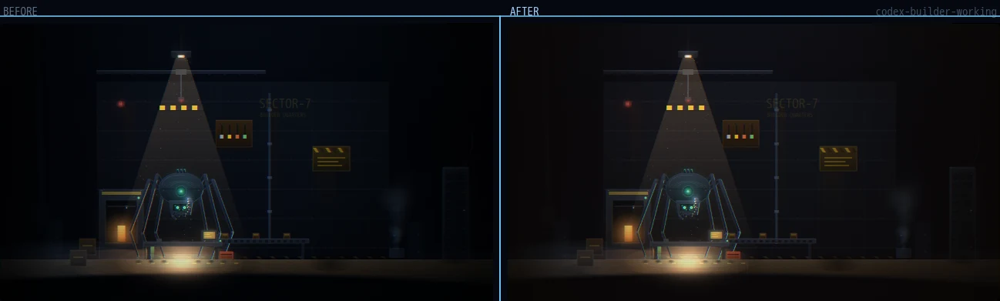
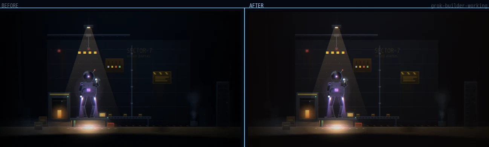
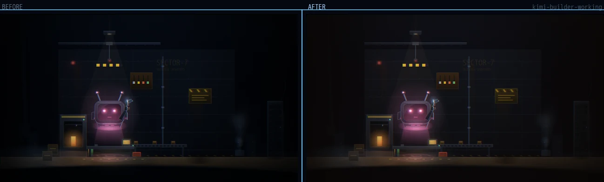

### The three rooms came out of the compositor the same colour

Every prop, wall and floor had been tinted one at a time, by hand, across eight
loops — and all three rooms still photographed as the same neutral blue-black,
because **a grade is a property of the whole frame** and nothing was applying
one. Three rooms lit by the same lamp should still not photograph identically.

Two passes: a lift into the shadows, which is what actually carries the colour
of a dark scene, and a screen over the highlights so the key light picks up
temperature. Deliberately small — this is a grade, not a filter, and it has to
survive being looked at 36 times on one page.

- **builder** — `255,176,96`, tungsten
- **reviewer** — `122,196,255`, daylight-balanced
- **triage** — `186,150,255`, cold violet

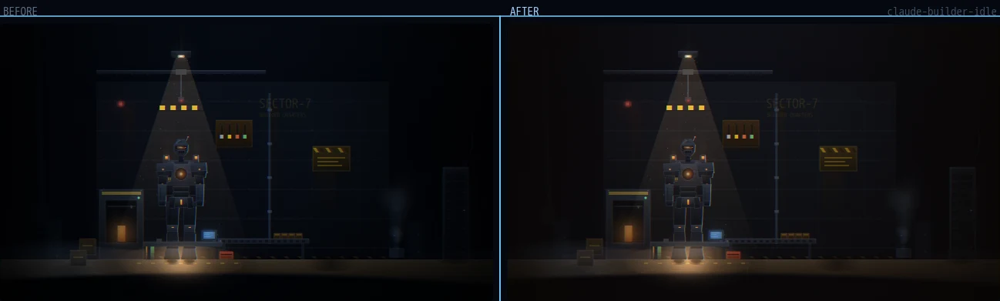
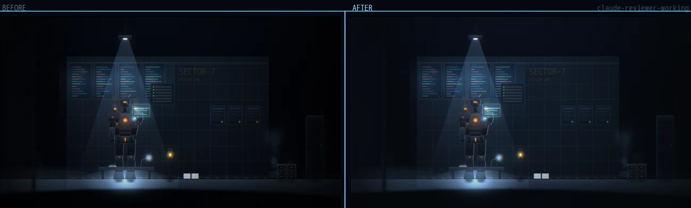
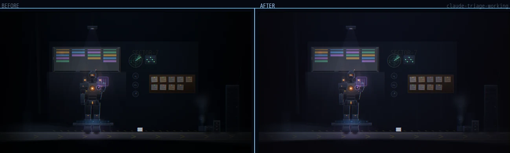

> A grade touches every pixel, so the changed-pixel share for this loop is
> ~97–99% everywhere. That number stops being informative here; the images are
> the evidence.

---

## Loop 10 — the last details

Nine loops of structure. This one is the small stuff — each of these is a thing
the eye lands on once and then stops asking about.

### claude — the beacon blinks
It was a constant red dot: an aircraft warning light that never flashes, which
is the one thing they all do. Now a double-strobe with a short halo, giving the
highest point on the unit the only hard rhythm in the frame.

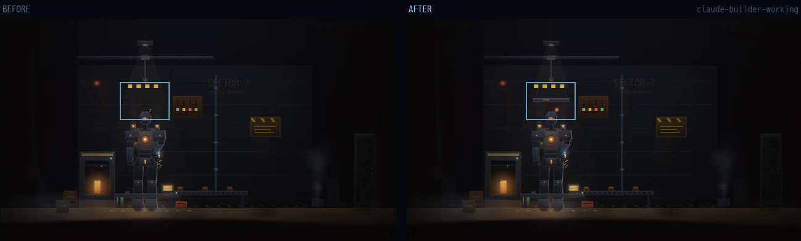

### codex — claws
Each leg ended in a small triangle. Six points, with nothing explaining how
they hold a heavy shell steady. Two hooked tips splayed against the load is
what an insect foot does — and it gives the contact shadows something to be
cast *by*.

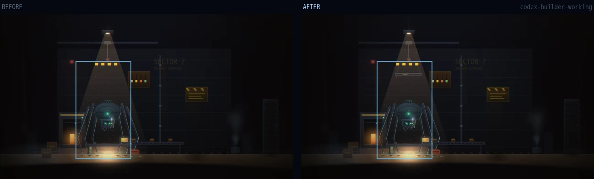

### grok — a helmet lamp
An EVA suit carries one; it is the reason the visor can be mirrored and the
wearer can still see. The only unit whose face is a mirror had no light of its
own. Mounted left, throwing a short forward cone while working.

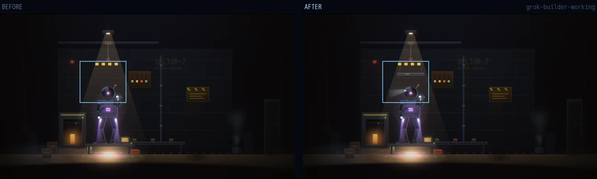

### kimi — a status strip
Kimi was the only unit with no hard readout anywhere — claude has a core, codex
a reactor, grok a chest panel — so its state lived entirely in a face, which is
expressive and says nothing precise. Five cells filling left-to-right while
working, one slow pulse while idle.

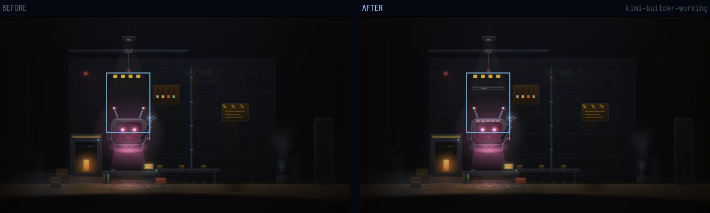

### builder — the crane carries something
A gantry with an empty hook parked dead centre over the work is set dressing. A
slung girder on two slings is the bay telling you what it is for.

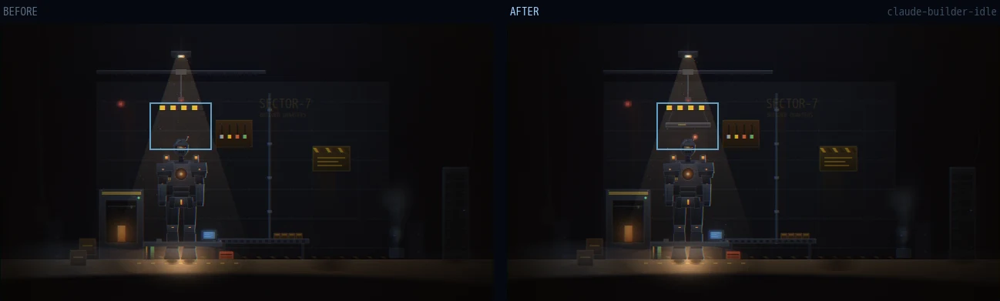

### reviewer — something under the lens
The inspection desk had a lamp, an arm and a bare worktop: a review station
with nothing being reviewed on it. A lit specimen plate directly beneath the
lens is what the whole prop exists to point at.

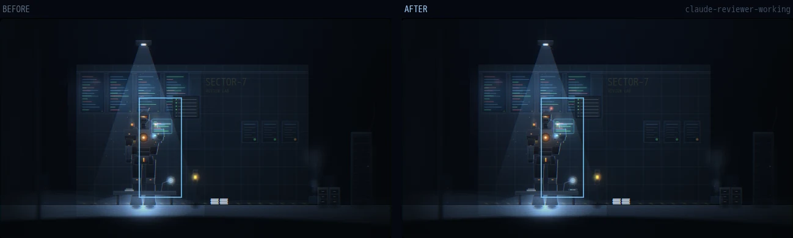

### triage — a line is ringing
The phone bank was two dark handsets in a box — furniture, in the one room
whose entire job is routing things to people. One line now rings, with an
expanding indicator: the only event-shaped thing in the dispatch room. Silent
when the box is.

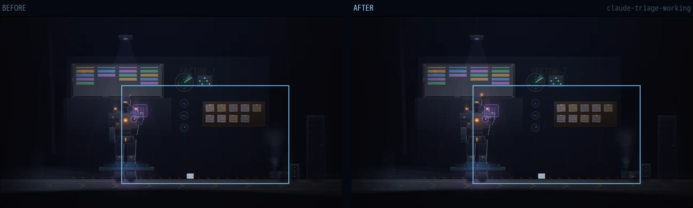

> Changed-pixel shares here are 0.08–0.66%, an order of magnitude below every
> earlier loop. That is what a detail pass should look like — and it is only a
> readable number because loop 8 removed the ~1.8% grain floor that would have
> buried all seven of these.

---

## End to end

Every robot and every room, baseline → loop 10, as one animation each:
**[`GIFS.md`](GIFS.md)**.

---

## Loop 11 — the sign gets a wall to hang on

Ten loops added things to the back wall. None of them ever asked what was
already there, because **the wall text was not an object**: two `fillText`
calls at 8% alpha, with no extent, no owner and nothing to collide with. So
each new prop was placed as though that space were free, and three of them
ended up on top of it.

| room | what was on the sign |
|---|---|
| **builder** | the conduit run — a full-height vertical pipe straight through `SECTOR-7`, and "BUILDER QUARTERS" behind its brackets |
| **triage** | the radar dish over the `S`, the relay panel across the rest, and "DISPATCH" buried completely |
| **reviewer** | clear of the sign, but the checklist board was hung *on* the fourth diff monitor |

Individually every one of those props is fine. Together they read as three
rooms nobody composed.

**A named rectangle, and a sign that is a thing.** `SIGN` reserves
`676,182 → 984,270` of back wall. Nothing may be drawn into it but the room's
name — so a prop that lands there is now a visible mistake against a stated
rule, instead of a thing that looked free. And the sign itself became an
opaque bolted plate: a panel with a rolled top edge that takes the lamp, four
bolts with rust weeping from the lower pair, and stencilled type with a dark
bite below and left of each glyph, which is what paint sprayed through a mask
onto rolled steel does under a light that is off to one side.

> **The builder's conduit did not move.** It is the only vertical on that wall
> and the bay needs it. It now passes *behind* the plate — drawn opaque, last —
> and comes out underneath with a stain weeping from the joint. The prop was
> never the problem; crossing the room's name at full contrast was.

Two props did move, and both moved into a composition rather than out of the
way: dispatch's radar and relay panel dropped into a column with the zone
clocks and under the work-order board — instruments together, paper together —
and the lab's checklist board moved into the gap between the monitor bank and
the certification plates, where it reads as the step between them: what was
checked, then what was signed.

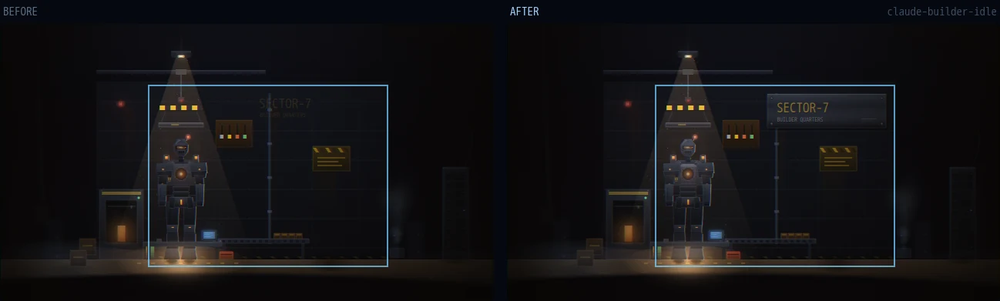
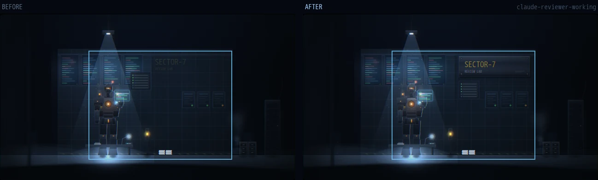
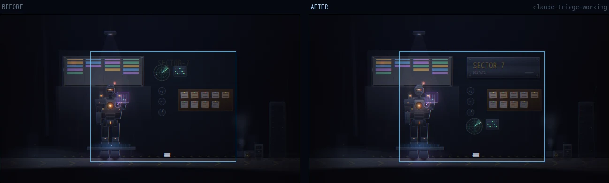

### Every unit: a modelling light

`plate()` is a two-stop vertical gradient fitted to each polygon's own bounding
box. Which means a pauldron and a boot were lit identically — every panel on
every unit got its own private little sky, and none of them was brighter for
being higher, nearer the lamp, or facing it. That is the recipe for a flat
cut-out, and it is why the rim light has been carrying all of the separation on
its own since loop 6.

`modelLight()` is one pass in body space, `source-atop` so it lands only on the
silhouette: upper surfaces gain, the recess under the chest and between the
legs loses, and the deck throws a cool bounce onto the lowest quarter. It is
deliberately **not** per-agent — it is the room's light, and it has no opinion
about who is standing in it. It runs inside `buildRobo`, so the god-view
thumbnails get it too; putting it in `drawRobot` would have lit the console's
four units differently from the floor's.

Then one structural fix each, on whatever the new light exposed as flattest.

### claude — a sternum, so the chest is not a slab with a circle on it
The reactor was a lit disc cut into a single polygon: the largest surface on
the unit, with the brightest thing on it having no mounting. A raised centre
housing steps the chest forward, and two collarbone struts from the collar to
the shoulder joints explain how the arms are carried.

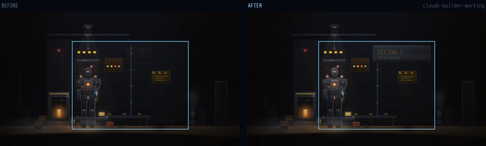

### codex — tergites, so the shell is armour and not a balloon
The abdomen was one ellipse: grained and riveted since loop 6, and still a
single closed curve. An arthropod's dorsal shell is overlapping plates, each
casting a hard line onto the one behind and catching light on its leading edge.
Three of them, clipped to the dome, at two strokes apiece.

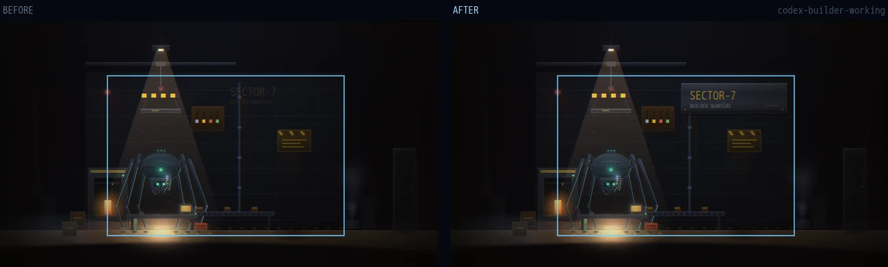

### grok — the hard waist bearing a pressure suit cannot do without
Grok has had a neck ring since loop 2 — the hard component a soft suit needs so
the helmet can turn against pressure — and then ran uninterrupted from collar
to legs, which is the one thing a real suit cannot do. The lower body rotates
against the upper, and that join is always a machined ring. It splits the
flattest surface on the unit in two, and gives the dangling legs a visible
point of attachment instead of emerging from cloth. A harness and a hip pouch
ride on it.

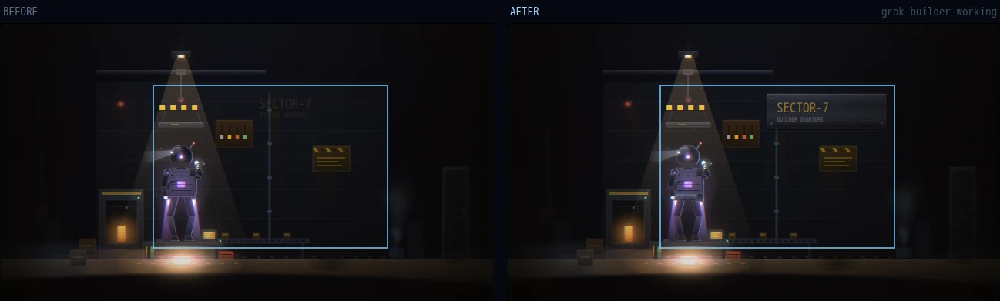

### kimi — corners, so the silhouette is not one primitive
Kimi's body was a rounded rectangle with a screen cut out of it: the only unit
in the fleet whose outline is a single primitive, and the one the eye reads as
*drawn* rather than assembled. Four corner bumpers — what a machine that floats
face-first through a workshop would actually have — break the outline at
exactly the four points that were most obviously a computed radius, and are the
first thing on this unit not concentric with the screen. A shell parting line
runs the casing at mid-height with the front lip catching the lamp.

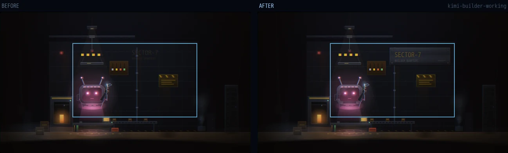

> 3.8–5.4% changed across all seven. A modelling light touches every lit pixel
> of every unit, so the robot numbers are a floor, not a measure of the
> structural work on top of them.

---

## Loop 12 — the light lands on the wall

There is one lamp in these rooms. It throws a volumetric cone through the air
(loop 5), a pool onto the deck (loop 5), and a bounce off every emissive onto
the plates around it (loop 5 again). And then the 760 × 462 surface directly
behind all of that received **nothing at all**: the far corner of the back wall
was exactly as bright as the patch two metres under the bulb.

That is why these rooms have always read as a lit robot standing in front of a
flat backdrop. The backdrop was not in the same lighting model as anything
else in the frame.

**`wallKey()`** runs after the wall attachments and before the cone, clipped to
the wall rect, additive, in the room's own light colour. Because it runs after
the props, the monitor bank, the kanban board and the certification plates take
the same falloff the wall behind them does — one lamp, one grade.

Its second half is the opposite: contact darkening where the wall meets the
floor, where it runs out at either end, and where it disappears into the
ceiling. A wall lit uniformly to its own edges has no corners, and each of
these rooms has four.

> **A finding the pass produced, and then had to fix.** The first render came
> back with two tiles of the *same room in the same state* showing the wall 9
> luminance steps apart. The wall itself was identical before the change
> (25.6 vs 25.8) — the only per-tile variable feeding `wallKey` is `lit`, and
> `stepLamp` drops the lamp out for a few frames at random. Wired straight to a
> 190px cone that reads as a failing tube. Wired to 760 × 462 of wall it reads
> as a rendering fault. The wall now keeps a third of the swing, which still
> ties it to the lamp: tile spread went from 8.1 luminance steps to 3.5.

**Every bolted prop now stands off the wall.** `plate()` gives a prop internal
shading and stops at its outline, so a monitor bank, a kanban board and a
hazard placard all met the wall at a clean cut — the clearest possible tell
that these are props *drawn on* a room rather than *in* one. `wallShadow()` is
one soft offset shadow whose direction and distance come from where the prop
sits relative to `LAMPX`, so the whole wall agrees about where the light is
instead of each object holding a private opinion. Nine call sites: the sign,
the pegboard, the hazard placard, the diff monitors, the checklist board, the
kanban board, the certification plates, the work-order board, the zone clocks,
the radar and the relay panel.

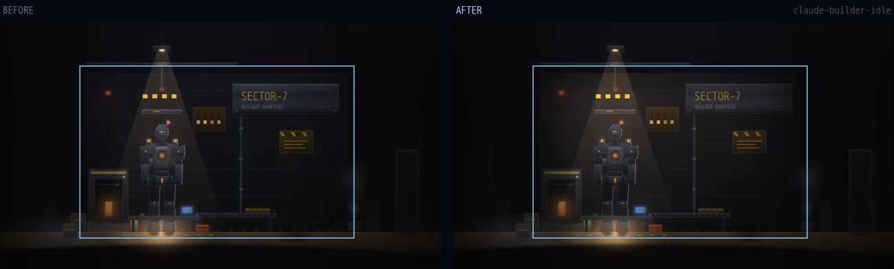
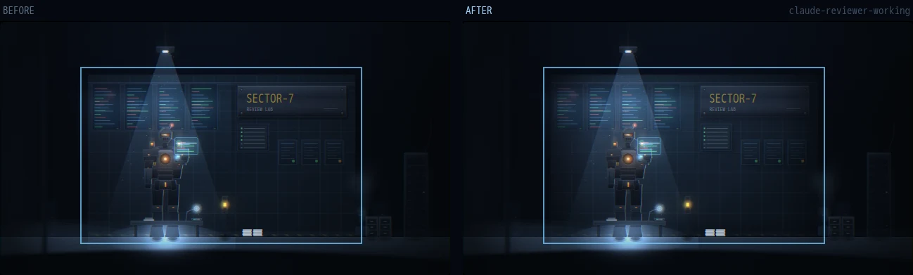
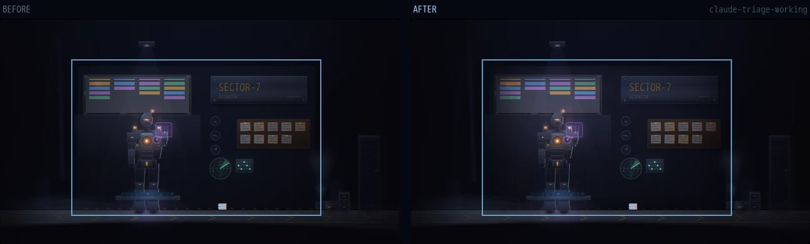

### Every unit: cavity occlusion

`modelLight` from loop 11 is a sky. It knows how high a surface sits and
nothing whatever about what is directly above it — so every overhang on every
unit cast nothing onto the part beneath it, and an overhang that casts nothing
reads as a decal on a flat panel rather than as one part in front of another.

`cavity()` is the short-range half of the same light: a hard falloff a few
pixels deep, immediately under whatever is in front. It is the cheapest
possible ambient occlusion and it is the whole difference between layered and
printed.

| unit | the join that was open |
|---|---|
| **claude** | chest over abdomen, pelvis over thighs, collar over the sternum housing loop 11 added — three seams |
| **codex** | the deepest overhang on any of the four: the entire abdomen sits in front of and above the cephalothorax, and the two met at a clean line |
| **grok** | a helmet on a neck ring sits proud of the shoulders it turns above. The shadow also lands across the chest quilting, which is what says the suit is cloth under a hard part |
| **kimi** | the bezel stood proud of the glass and threw nothing onto it — on the largest flat area in the fleet, and the one surface the eye actually goes to |

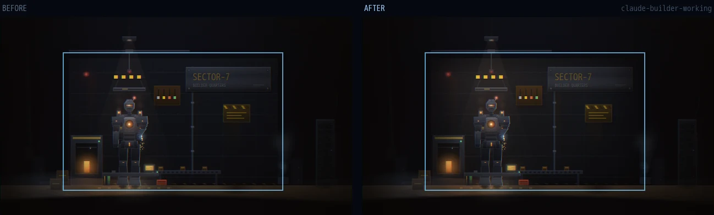
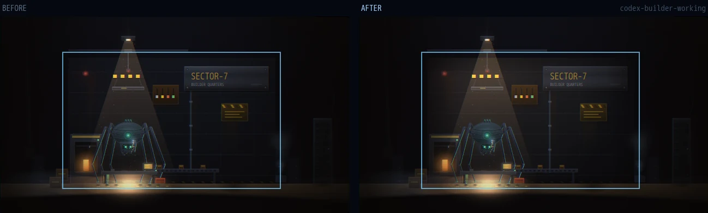
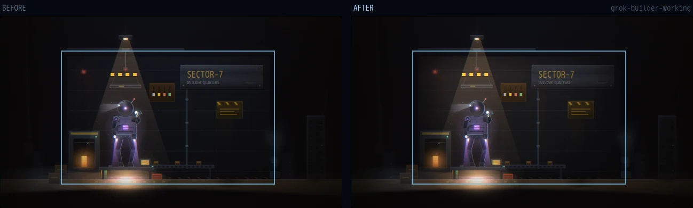
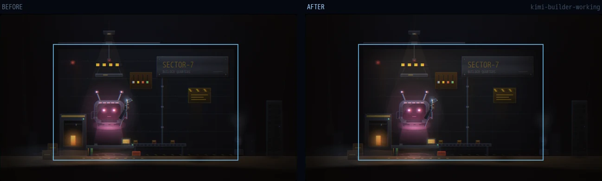

> 11–18% everywhere: a light that reaches a surface changes every pixel of it.
> The residual spread between tiles is the damped lamp flicker described above,
> and it is now smaller than the difference between the three rooms' grades.

---

## Loop 13 — furnish the bays

Loop 11 reserved one rectangle and that was enough to stop props landing on the
room's name. It left every *other* placement still being decided by eye, one
prop at a time — which is the habit that put them on the sign in the first
place. So before anything new went up, the whole wall got stated.

**`BAYS`** names what is free in each room, and what bounds it:

|  | x | y | w | h | bounded below by |
|---|---|---|---|---|---|
| builder `L` | 250 | 188 | 126 | 216 | the fab bay (y=430) |
| builder `R` | 726 | 404 | 270 | 148 | the deck |
| reviewer `L` | 262 | 336 | 164 | 170 | the inspection desk (x=372) |
| reviewer `R` | 690 | 428 | 300 | 124 | the deck |
| triage `L` | 262 | 330 | 160 | 196 | the map console (x=372) |
| triage `R` | 836 | 424 | 160 | 128 | the deck |

Two constraints did most of the work. The unit stands at `ROBOX=470` and is
about 220 wide, so the centre column is not wall you can hang anything on — it
is wall you look at the robot *against*, and the lamp cone runs down it. And
every room already has floor-standing furniture backed against the wall, so a
bay stops where that starts. Each of the six was verified empty against the
loop 12 renders, and each is quoted by name in the prop that fills it.

### builder — gas, and something to put the fire out with

The fabricator has been throwing a furnace flame since loop 3 and **nothing in
the room has ever supplied it.** Two cylinders strapped to the wall directly
above the bay, with regulators and a hose dropping toward it, is what makes the
fire an installation rather than an effect. (They are drawn with a *horizontal*
gradient, which is the whole difference between a cylinder and a rectangle —
every other prop in the fleet is lit top-to-bottom because every other prop is
flat.)

And the wall carried a hazard placard warning about a danger with no answer to
it anywhere in the room. The fire point goes directly underneath it, which is
what turns two props into one piece of signage.

> The first cut of the fire point used workshop-red at full saturation and
> immediately became the brightest object in the bay. A fire point should be
> *findable*, not the thing you look at instead of the unit under the lamp.

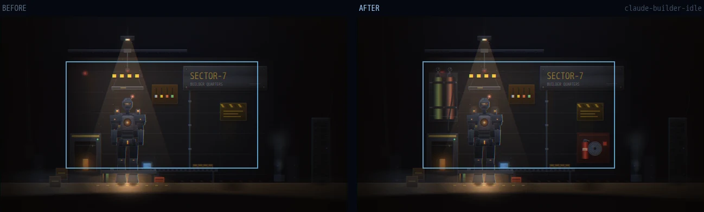

### reviewer — a chart to check the instruments, and somewhere for the work to go

A lab whose entire job is looking closely at things had nothing on its wall for
checking that it can still see. The calibration chart is the only prop in the
fleet whose content is a *measurement* rather than a readout — greyscale wedge,
converging resolution wedges, registration crosses — and it is the one prop
that deliberately does not animate, because a test target that moved would be
useless. Its wedge tops out at 60%, not white: printed paper in a room lit to
12% is not paper-white, and the first cut read as a lightbox.

Everything this room does ends with something being filed — loop 10 gave the
lens a specimen, loop 8 gave the wall plates to sign — and there was nowhere
for any of it to go afterwards. The sample archive is twenty-one drawers, three
of them pulled, one lit from inside.

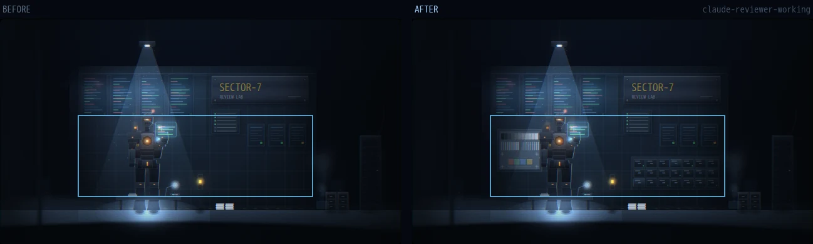

### triage — a tube, and the names of the people on shift

Dispatch is the room that moves things to people, and it did it entirely
through screens. A pneumatic tube is the one piece of dispatch furniture that
is physically about transit: you can *see* the thing being sent. A carrier
rises through the run while the box is working and the head lamp answers when
it arrives.

> Its first cut had a collar every 44px and read as a ladder — the prop said
> "climb me" in a room with nothing to climb to. A tube has a joint where it
> passes each floor and nowhere else, so it has two.

And the room that routes work to people named nobody. The duty board is six
slots in a rail with a shift lamp each: on duty, on call, off. It is the only
prop in the fleet that is about *who* rather than *what*, which is most of the
difference between a dispatch desk and a status screen.

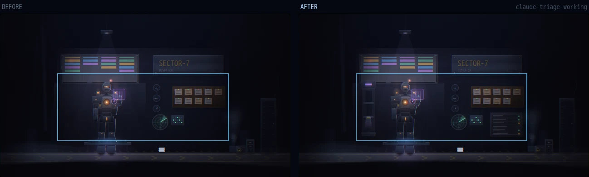

### Every unit: it has been used

The four units left the factory in loop 1 and have been perfectly clean through
twelve loops of lighting them better. Wear is not decoration here — it is the
only thing on any of them that says what the unit has been *doing*.

| unit | what it does, showing |
|---|---|
| **claude** | soot around both exhaust stacks, heaviest at the lip and fading up. They have been venting since loop 3 onto plate that stayed factory-clean |
| **codex** | a hazard stripe on the leading tergite. It carries a heavy shell through a workshop at head height and nothing said so — a marking the *other* units need |
| **grok** | knee scuffs and dirt up the lower legs. It is the only unit whose surface is soft, so it should be showing *more* wear than the armoured ones, not less |
| **kimi** | scuffed corner bumpers, and an asset tag with the bottom corner lifting. Loop 11 put those guards on because a machine that floats face-first through a workshop protects its corners; leaving them pristine quietly contradicted the reason they exist |

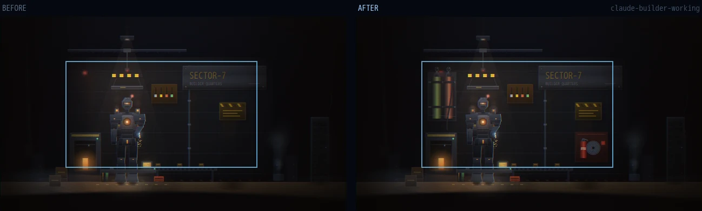
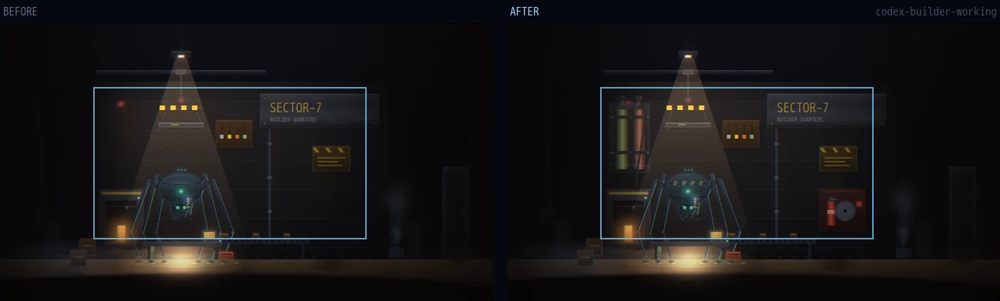
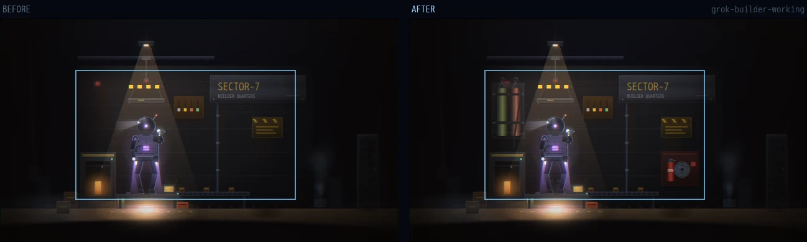
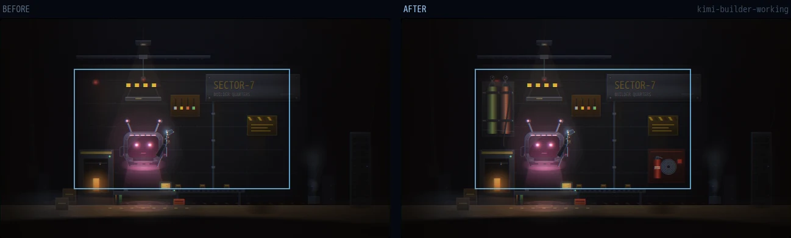

> 3.1–4.1%, evenly. Six new props and four wear passes, and not one pixel of
> it lands anywhere another object already was — which is what having the
> bay table was for.

---

## Loop 14 — three planes instead of two

The frame had a wall with everything on it, and a unit in front of the wall.
That is two planes, and two planes is a picture. It is not a room.

Three things were wrong with it, and each is a different distance from the
viewer.

**Far — the wall was rendering at the unit's contrast.** Black blacks, hard
edges, full saturation, on a surface that is metres further away than anything
else in the frame. Air between two objects lifts the far one's shadows and
pulls it toward the colour of the light, and there was no air in these rooms
at all. `wallKey` now finishes with a 5.5% veil of the room's own light colour
across the whole wall plane. It is the smallest number in this loop and it is
doing more for depth than the other two changes together.

**Middle — there was nothing there.** Above the unit sat 150px of flat black
doing no work, and the only light in the room hung out of it on a stalk
attached to the top of the canvas. `roofTruss` crosses in front of the wall and
behind the unit: a lattice beam, purlins, four hangers and the cable tray they
carry, and the lamp now bolted to the underside of it. The rooms have a ceiling
the way loop 1 gave them a floor. It is kept dark and low-contrast on purpose —
a silhouette is the right amount of detail for something between the viewer and
the light, and on the far left and right, where the lamp does not reach it, it
correctly disappears.

**Near — the camera was outside the room.** `drawForeground` has laid a blurred
lip across the bottom of the frame since loop 7; `nearEdge` is the same idea
turned vertical at the left margin, well out of focus. An out-of-focus object
between the viewer and the subject is the cheapest possible way to say the
camera is *inside* the space rather than looking through a window at it. Left
only — the right side already has the tower, the steam vent and the file
cabinets doing that job with real geometry.

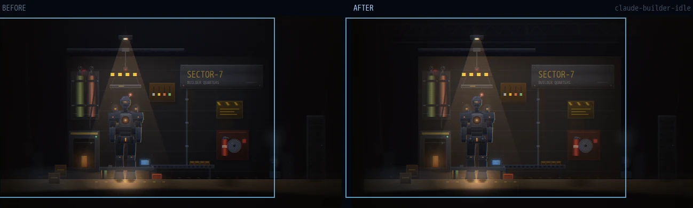
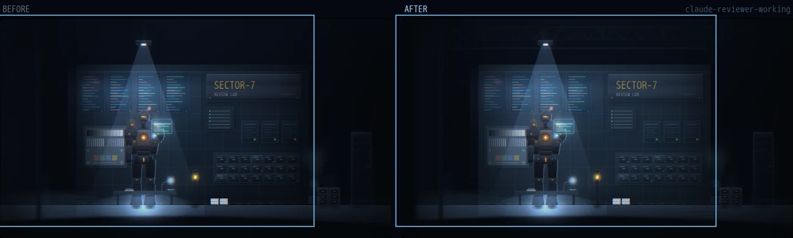
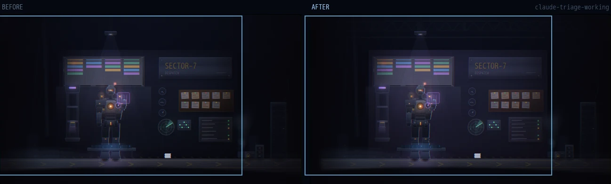

### Every unit: which way does it bend

Thirteen loops of surface, and on three of the four units you still could not
tell where a limb was allowed to move. A joint is not decoration — it is the
difference between a figure and a mechanism, and it is the one piece of
information a machine's silhouette owes you.

| unit | the joint that wasn't there |
|---|---|
| **claude** | every limb met the body at a straight edge — arms off a pauldron, legs out of a tasset, nothing saying which way any of it goes. Ball-and-socket hips with a lit crescent on the lamp side, and a pivot bolt at each knee |
| **codex** | the knee and ankle have had proper joints since loop 2; the place each leg meets the **hull** was a 5.5px dot, so eight legs appeared to emerge from the body rather than be mounted on it. Armoured coxa sockets, hull side darker than leg side — which is what says one goes inside the other |
| **grok** | smooth tapers from hip to boot, which is a drawing of a leg rather than a suit. A pressure suit bends where it is corrugated to bend and nowhere else: three convolutes at each knee, brightest on the fold facing the lamp |
| **kimi** | no legs, no arms at rest, and the one place it *can* articulate — the mount between body and skirt — was a gap. A yoke and trunnion, which is what holds anything that must stay level while what is under it moves, and the mechanical reason kimi can face you while drifting sideways |

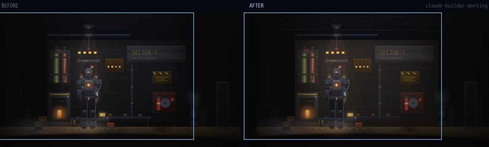
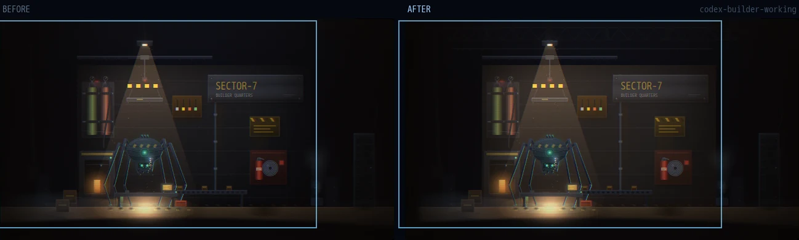
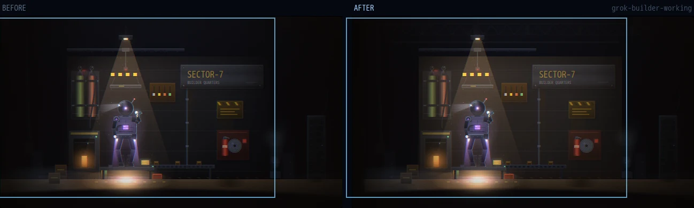
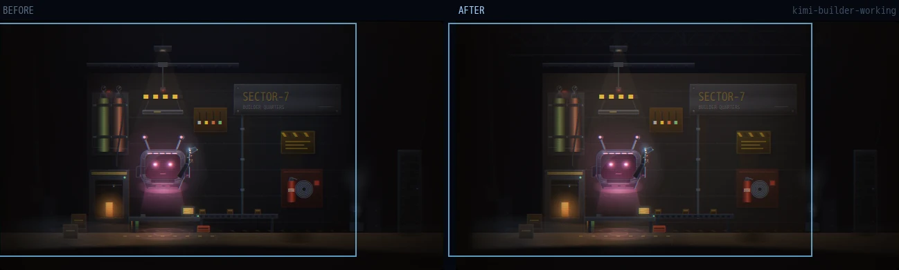

> ~35% everywhere, and for once the number is honest about what happened: a
> plane-wide veil plus a new object crossing the top of every frame touches
> a third of the pixels in all 36 tiles. Same class of change as the loop 9
> grade — the images are the evidence, not the percentage.

---

## Loop 15 — close the box, finish the metal

Pull the exposure up two stops on any room from loop 14 and the same thing is
wrong in all three: **the back wall is a large lit rectangle that simply ends.**
A hard vertical cut, with black on the other side. Loop 12 put a darkening
gradient at each end, which softened the cut without explaining it — and
nothing explains a wall ending except a corner.

`pilasters()` gives each end the structural column the wall is built against: a
face turned slightly away from the room, a bright arris where the two planes
meet, a shadow thrown back onto the wall in front of it, a capital and a base.
The arris is the point. A hard bright vertical at each end of the frame is what
makes the wall read as **one face of a box** rather than as a backdrop hung
behind the set — and it costs a rectangle and a 2px line.

**One diagonal.** Every edge in these rooms is horizontal or vertical: the wall
grid, the props, the bays, the truss, the tray. In fifteen loops the only
exceptions have been the lamp cone and the builder's gas hose. A grid with no
diagonal in it reads as a diagram. `cableSwag()` hangs three catenaries off the
tray loop 14 installed — the cheapest true curve there is, belonging to a
ceiling that now exists to hang things from, crossing in front of the wall and
behind the unit so the line runs *through* the middle plane rather than along
it.

**And the vignette moved onto the subject.** It was centred at `0.46` of the
frame — nearer the geometric centre of the canvas than to the thing the picture
is of. The unit stands at `ROBOX/DW = 0.367`. A vignette's entire job is to say
where to look, and it was pointing at a spot two metres to the robot's right.
It costs the right-hand props a little falloff, which is the correct trade:
they are context and the unit is not.

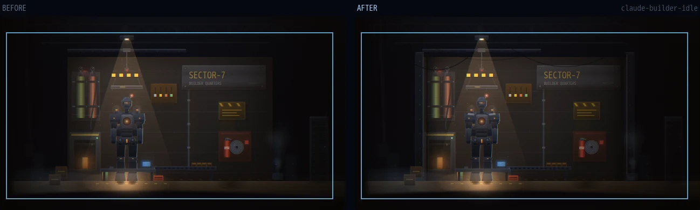
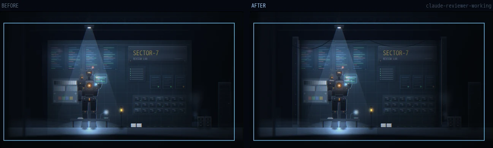
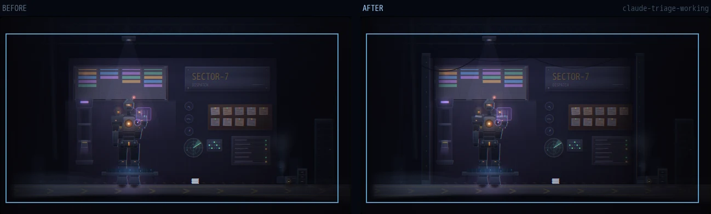

### Every unit: a specular

`modelLight` (loop 11) is diffuse. It says how much light a surface *receives*
and nothing about how sharply it gives it back — so for four loops every plate
on every unit has had the reflectivity of matte paint. A specular is the small
hard hit where a curved surface aims the lamp straight at the viewer, and it is
the last thing standing between painted metal and metal.

The interesting part is that the right answer is different for each of the
four, because they are not made of the same stuff.

| unit | material | so the highlight is |
|---|---|---|
| **claude** | rolled armour plate | two hard slivers on the pauldron crowns — the surfaces actually facing up |
| **codex** | a machined shell | one tight hot spot up and left, plus the wide soft return underneath. The largest curved surface in the fleet, with a grain since loop 6 and tergites since loop 11, and never once a highlight — which is why it kept reading matte no matter how much structure went onto it |
| **grok** | fabric | almost none. It is deliberately the matte one, which makes the two machined components it carries — the neck ring, and the waist bearing from loop 11 — the *only* places a specular belongs. Putting it exactly there is what tells you the rest is cloth |
| **kimi** | moulded casing | a long soft band along the crown, wrapping the corner radius its bumpers interrupt. It has had a gloss sweep on the **glass** since loop 8, which is exactly why the screen looked like glass in a body that looked like a flat fill |

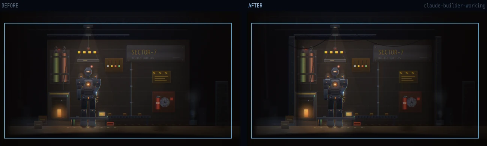
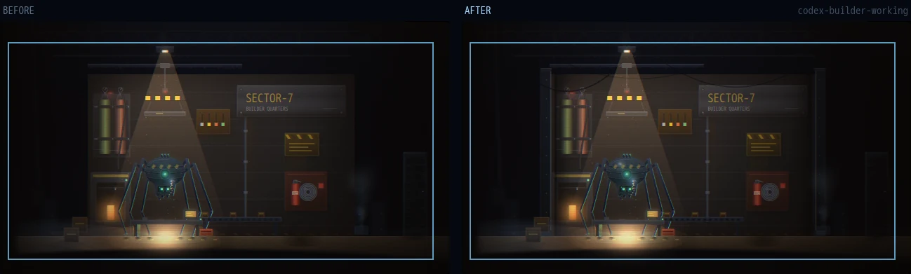

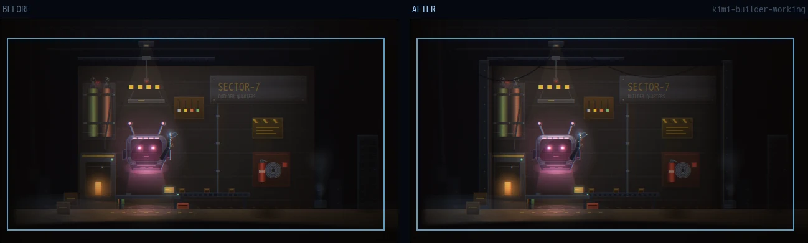

> 12–16%. A vignette moves, so every pixel moves.

---

## Where fifteen loops got to

Loops 1–10 built the rooms and the robots. Loops 11–15 were about **the picture
they are in**, and the through-line is that almost every fix was structural
rather than decorative:

- **11** — the sign became an object with a bounding box, so props could stop
  landing on it
- **12** — the wall entered the lighting model that everything else was already in
- **13** — the free wall got *named*, and then furnished, so placement stopped
  being decided by eye
- **14** — a middle plane and a near plane, so the frame stopped being a
  backdrop and a subject
- **15** — the box got its corners, the grid got its diagonal, and the vignette
  got pointed at the robot

The one rule that produced most of it: **when something is in the wrong place,
find out what it was allowed to collide with.** The builder's conduit never had
to move. The signage just had to exist.


---

## After the loops — the review

Fifteen loops, then someone opened the PR in a browser and looked at the view
the loops were *not* about. The defect register is on the PR; what follows is
what it cost and what changed.

### The god-view cell was a second room

`drawMini` had its own wall, its own floor, its own overhead lamp, its own role
prop and its own signage, and shared nothing with `drawTarget` but the robot
sprite. One of the fifteen loops touched it:

```
git log -L :drawMini:fleet-floor/src/app.js 17acc04..e3828a8
→ 00339c3  loop 8 — the god-view cell catches up      (the entire list)
```

So the cell still carried a 7%-opacity `SECTOR-7` painted straight onto a bare
wall — the exact ghost loop 11 removed from the room — plus a desk drawn
through every walker's shins, a wall with no structure below its gradient, and
role props too small to identify. In the view the console opens on.

The cell renders the real room now: same `drawTarget`, borrowed through the
same seam the asset map uses, cached as a still per unit and composited with
the few things that have to keep moving. Those four defects are gone because
the code that drew them is gone.

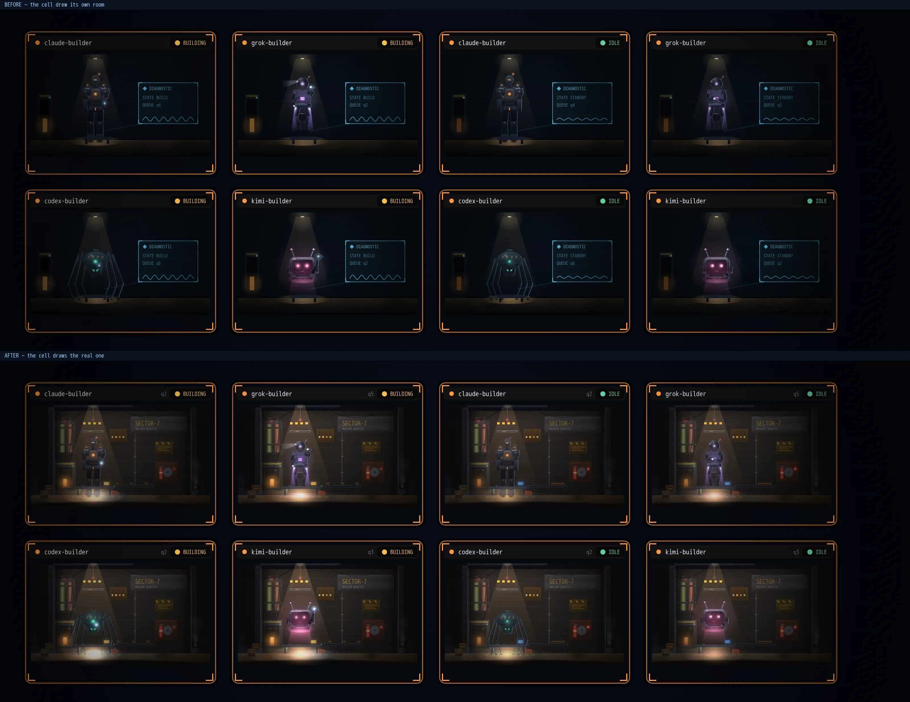

It is also **faster**, which was not the point but is the answer to "can the
god-view afford a real room": one still per cell, at most one render a frame,
on a cadence that backs off when a room turns out to be expensive.

| headless, software rendering | 7 cells | 24 cells |
|---|---|---|
| merge base | 70 ms/frame | 90 ms |
| after fifteen loops | 92 ms/frame | 115 ms |
| after this | **16.7 ms** (vsync) | **16.7 ms** |

### Two marks that were pinned to a bounding box

The cell's offline `!` sat at the top of the sprite's bounding box plus a
guess, which is the head for claude and grok and empty air for codex, whose
body hangs low inside an arch of six legs, and kimi, whose rotors stand over
its shell.

The room had the same bug at full size and nobody had seen it: its offline
diamond hangs off `hy`, which is the *visor* — the point a holo tether leaves
from — and the visor is 93px below the top of codex and 62px below the top of
kimi. So the diamond sat among codex's legs in every room and every state.

Both read `unitTop` now: the top of the sprite the renderer just built,
measured off its alpha, cached per agent and state. Measured rather than
tabulated, because four hand-written numbers go stale the first time a robot
changes shape and do it silently.

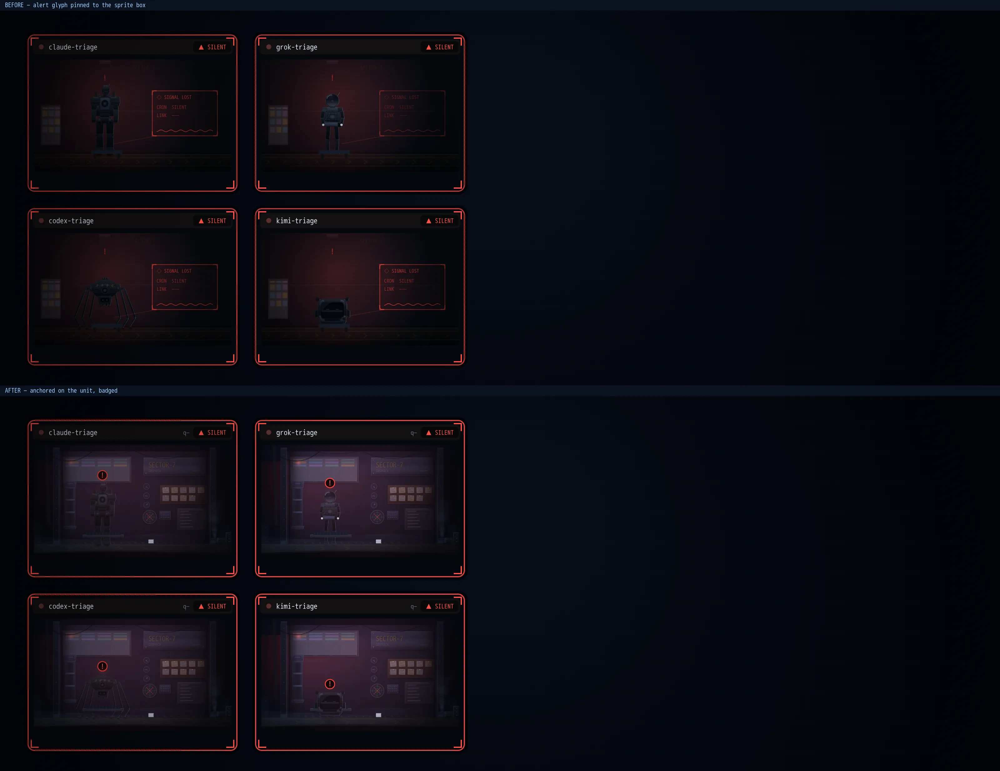

### A drone that had been swallowed by the furniture

Every room stands its bench, desk or console in front of the unit, which is
right for the three tall vendors. kimi is a wide drone that hovers while
powered and settles when it is not, and a settled drone is 122px tall — so the
desk top cut it in half and the console showed a dark lump lying on the bench,
in all three rooms. Only findable at full size, which is exactly what the
full-resolution pass over the 36 room tiles was for. A drone that has set
itself down does not do it *inside* the bench: it lands on the open deck, in
front of the furniture.

### The rest of the layout, stated

Loop 13 named six wall bays and left "every other placement still being decided
by eye, one prop at a time" (LOOPS.md:822 — this file). `LAYOUT` now states the
deck each room carries, the fixed structure, the deck line, and the unit
envelope, and `?guides=1` draws all of it over a rendered tile.

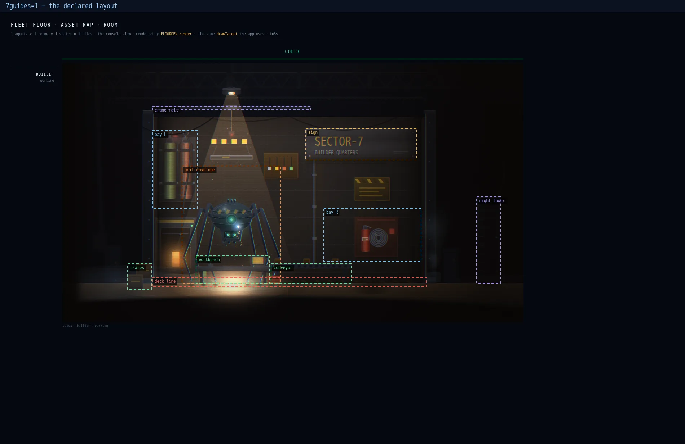

Writing it down found two collisions the same afternoon:

- the builder's conveyor began ten pixels inside the workbench top — four
  pixels tall, both surfaces dark, invisible for fifteen loops;
- and the first hand-written unit envelope was itself wrong in both directions,
  narrower than codex and wide enough to overlap the pegboard. It is measured
  now, like the tops.

### And the cell got a map

The room had one and the cell did not, which is the whole reason the defects
above survived: the roster exercises seven of the cell's thirty-six
combinations and the rest are unreachable in a healthy fleet. `?view=cell`
renders all 36 through `FLOORDEV.renderMini` — the shipped `drawMini`, no
second copy of anything.

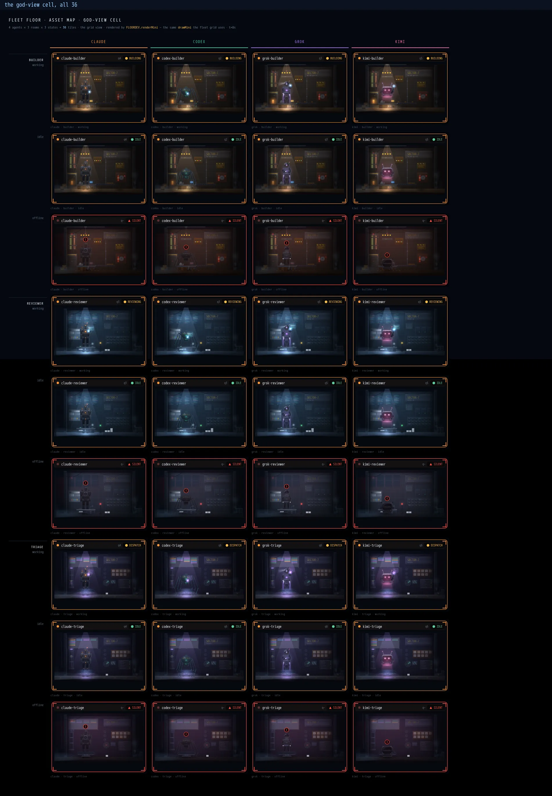

Determinism holds across the pair: two browser launches, **72 of 72 tiles
identical**, full-page PNGs sharing a sha256.


---

## The deck station

The last thing in the room that had never been designed. All three rooms put
the same object in front of the unit — a 204×12 plank on two 8px legs at
x=372, with different things resting on it: a vise and a monitor, a lens and a
specimen, a lit chart. Fifteen loops went round it, and it survived them
because at a glance it reads as "a table" and the eye moves on. Look at it and
you can see the unit's legs through the gap under the top.

The footprint stays — it is a fact about the floor, not about the prop: the
deck has room for exactly one object between the fabricator and the conveyor,
and the other two rooms mirror that composition. Everything else is now per
room.

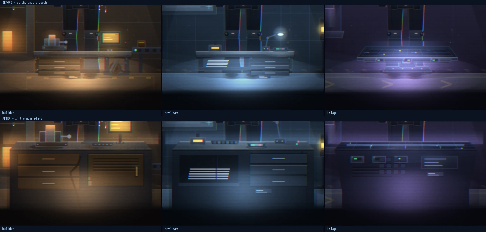

- **builder — a welding bench.** A chest of drawers under the left half so it
  has mass, an open frame with a cable spool under the right so it is not a
  solid block, a vise you can read left to right (base, fixed jaw, the stock
  standing in the jaws, sliding jaw, screw, handle), stock leaning against the
  chest, and the task monitor on a post.
- **reviewer — an inspection bench.** A pale worktop over a slim drawer bank,
  an open shelf with paper on it, the lens arm the room is named for with a
  specimen under it, and the verdict stamp block: the other half of what a
  review is.
- **triage — a plotting table.** A single pedestal instead of legs and a top
  **tilted towards the camera**, so the room that sorts and routes work reads
  at a glance as the one with a chart you stand over. Routing blips cross it;
  three toggles sit on the front rail.

Two things fell out of doing it. The tops came back too bright on the first
pass — a horizontal surface under a lamp does catch light, but it is not the
subject, so the body went dark and the light now lands on the leading edge
only. And the builder's toolbox is gone: it stood at x=574 with the conveyor
starting at 580, the same class of collision the declared deck caught last
time.

Both views change together, because there is one renderer.
