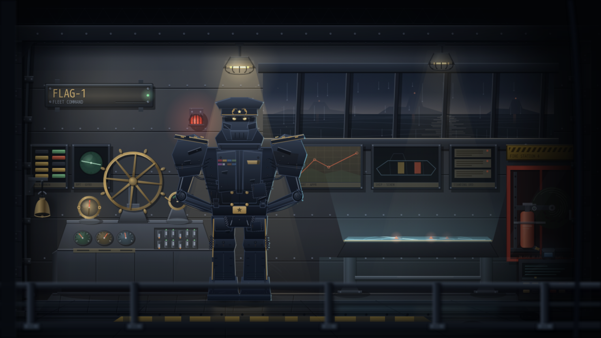
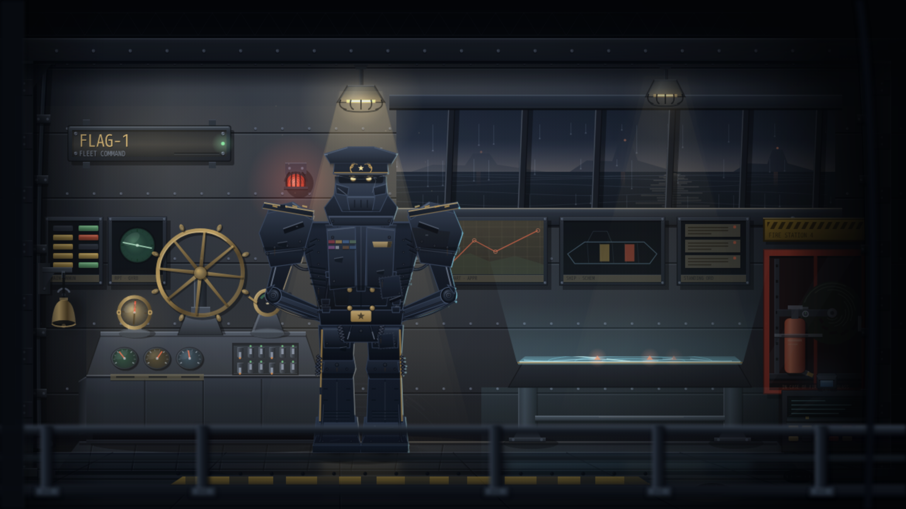
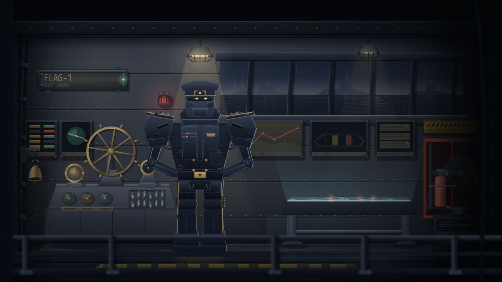
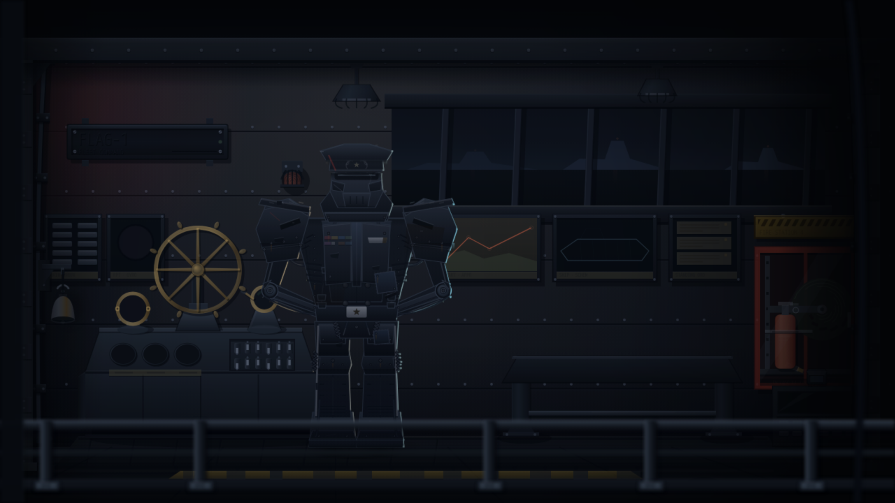

# leader — "ADMIRAL" (LD-01) · prototype A

Standing-look prototype for the **leader (foreman) agent** of crew#225. The
first **role droid**: its identity is the chair, not a vendor — so it wears
no vendor colour anywhere. Antique command brass is the role's palette.

Open `proto-a-admiral.html` in a browser (working / idle / offline buttons
under the canvas; `?state=X&t=N` renders a deterministic still).

## The concept

An admiral at **parade rest**: legs planted shoulder-width, arms clasped
behind the back, chin up. The leader never writes code, so it carries no
tools — the silhouette is chest, boards and cap.

Operator direction, revision one: the crimson command sash read *dictator*
and is gone. Rank now lives where a flag officer carries it — the cap, the
boards, and gold oak-leaf filigree on the bill — and the surface carries
the wars instead:

- **The cap is armour, not a hat** — crown, brass-corded band and
  laurel-and-star crest are helmet plates; the glossy bill wears the
  admiral's scrambled eggs and has a **notch shot out of its edge**
- **Hard slit optics** under the bill, lids cut on the glare angle; a
  **crack runs from the bill notch through the visor glass to the cheek**
- Greatcoat torso: double brass closure studs, **eight dulled service
  ribbons (one half torn away)**, a bent-wing breast crest, and a
  **bead-welded replacement plate** that doesn't quite match the coat
- Stepped shoulder boards with four rank bars — the **left board's brass
  edge broken by an old hit**; grime weeps from the pauldron bolts
- Scorched coat hem, patched thigh armour, scuffed boot braid, chipped
  boots — worn gold trouser stripes in place of the old crimson
- **The chassis shows at every joint** (revision two): power cables
  looping out of the collar and diving into the lower back, twin
  head-tilt pistons at the neck, hydraulic rams down each upper arm,
  true elbow joints (ring, hub bolt, guard horn, grease weep), hoses
  swinging under the arm pits, hip coil shocks and actuator rods on the
  pelvis, outboard knee springs, return hoses down the calves, ribbed
  ankle gaiters, intake gills low on the coat sides
- **Chad geometry** (revision three, against claude's unit as the
  benchmark): a faceted chest — raised centre slab with the side panels
  angled away from it, so light breaks over three planes; big trapezoid
  pauldrons that drape down over the arms rather than jutting out level;
  wider boards, chunkier thighs and boots with their own toe caps; a
  head and cap scaled up to hold against the shoulders
- **Surface**: rivet rows down both coat seams, intake grilles on the
  flanks (clear of the stud rows), knee bolts, grime weeps
- **Offline it stays at attention** — an admiral does not slump; the
  crest dies, the optics go dark, the service beacon rakes the cap

Written in the fleet-floor grammar — canvas 2D, `plate()`/rim/emissive
buffers, no assets, no deps — so it ports into a `buildLeader()` in
`fleet-floor/src/app.js` the way JUGGERNAUT ported into `buildKimi()`.

## The room — the flag bridge

The leader stands where a battleship is commanded from. Built against the
fleet's existing rooms as the bar (the builder's `SECTOR-7` workshop), which
is what set the checklist: a named board, props that each have a job and a
local colour, a real fixture at the top of the light cone, draped service
cables, wear on the deck, and structure framing the opening.

- **`FLAG-1 / FLEET COMMAND`** board on the clear bulkhead above the window
- **Raked armoured window band** onto deep nothing, with distant running
  lights blinking on their own clocks, riveted plate courses, deckhead beams
- **Props with local colour**: an engine-order telegraph on its pedestal with
  a live pointer, a red fire station with coiled hose, an amber hazard
  placard, a green/amber status board whose lamps drop out and return
- **Two light sources**: a hooded pan lamp on a drop cable overhead, and the
  **plot table off to port throwing light up** — its sweep arm runs
- **Wear**: conduit runs with junction boxes, rust weeping from the window
  bolts, scuff arcs on the deck where a watch has stood and turned, a coil of
  spare cable
- **Framed opening** with structural posts, corner gussets and a vignette, so
  the bridge sits inside a darker space rather than filling the frame

## Round 5 — ten loops on detail, not on composition

The operator's note on round 4: *the composition in both is decent, the amount
of things and their placing is not bad, but the quality and detail is really
poor.* That was the right diagnosis, and it pointed at one root cause. Every
prop listed above was already **there** — drawn, placed, and then rendered
invisible. The bulkhead topped out at `#0e1218` and the furniture sat on it at
alpha `0.06`–`0.16`, so the picture collapsed into a single value and every
object in it read as line-art. The builder quarters works because its wall is
a **mid tone**: props read light-or-dark against it, and saturated accents
have somewhere to pop from.

So loop 1 was the grade, and the remaining nine were the modelling that only
became worth doing once there was a value range to model in.

1. **The grade** — bulkhead lifted to real painted steel, re-lit with a damped
   key (`0.66+0.34*lit`, the trick `wallKey` plays in the app: an undamped
   lamp swings the whole wall and reads as a rendering fault, not as light),
   plus occlusion into the corners. Rivet courses got a bevel because there
   was finally room for one.
2. **The deck joins it** — the floor was left behind at `#0c1017`; a deck
   catches *more* of an overhead lamp than a wall does. Platform re-cut into
   three faces: top, lit nosing, shadowed riser.
3. **The glass** — a fifth of the frame was a black hole: the sea, horizon and
   three hulls were all drawn *behind* an opaque pane fill. Now night water
   with a horizon glow, a moon path breaking on the swell, hulls hazed by
   distance with their reflections, rain on the outside and the room's own
   lamps reflected on the inside. Sill rebuilt with real section and bolts.
4. **The fixtures** — the checklist item every other fleet room passes: a real
   object at the top of the light cone. Were flat trapezoids; now spun shades
   with a bounced interior, a hot rim, a wire cage and a shadow thrown up onto
   the deckhead.
5. **The signage board** — `FLAG-1` was flush to the wall and lit by nothing.
   Now a backlit box on stand-off brackets, engraved lettering, corner screws,
   a live pilot, and a shadow proving it stands off the bulkhead.
6. **The pedestal instruments** — helm, telegraph, gyro repeater and binnacle
   were all "a stroked circle on a rectangle". Each now has a pedestal with a
   lit and a shadowed side, a cast shadow on the deck, and its own material:
   the wheel is **brass**, which is the one warm thing a grey bridge owns.
7. **The plot table, as a light** — it is the room's second source and the
   reason the unit stands left of centre, but it was a dark trapezoid with
   three hairlines. Now a sheet of lit glass: cold cyan against all that
   brass, contacts casting shadows *across* it, and light thrown up onto the
   air, the bulkhead and the deck.
8. **The starboard wall** — fire station rebuilt as a cabinet with a glazed
   door, a wound hose reel and an extinguisher with a body, neck, handle and
   gauge; chevroned hazard placard; the console raked, with a live phosphor
   screen and keycaps that are moulded rather than filled.
9. **The cable runs** — two hairlines were doing the job of the draped service
   cabling. Four passes per run (wall shadow, body, core, lit crown) plus
   saddle clamps. Annunciator panel and chart board rebuilt at the same time.
10. **The deck, finished** — the painted margin was invisible under a
    `globalAlpha`; the floor was reflecting none of the three light sources
    now standing on it. Both fixed, plus turn scuffs round the unit's feet.

## Renders

| working | idle | offline |
|---|---|---|
|  |  |  |

## Round 6 — integration, not more detail

Round 5 raised the *fidelity* of each prop. The operator's note on it was that
the room still read as "a lot of things just thrown there" — correct, and a
different problem: fidelity is per-object, **integration is between objects**.
An adversarial review against the builder/reviewer/triage rooms (run blind, no
knowledge of intent) confirmed it and found the mechanical cause: **the deck
was drawn AFTER the furniture**, so the floor fill and the command platform
overpainted the bottom 24px of everything standing on them. Every prop was
literally having its contact with the floor erased.

1. **The room becomes a box** — pilasters, header, truss, reveal, darker
   surround. It had bled edge to edge, so there was no structure for anything
   to be installed *in*.
2. **The helm console** — wheel, telegraph, gyro repeater and binnacle were
   four objects on four disc feet spread across the deck like garden
   ornaments. Now one station: plinth, raked instrument face, wheel on a boss.
   The wheel was ~35cm against a 2m unit; it is ~1m now. The compass was
   redrawn as a gimballed dome after a blind reviewer guessed "upside-down
   lampshade, wastebasket, spittoon" before "binnacle".
3. **The wall becomes a rank** — one `panel()`, one baseline, one gutter, one
   bezel, which also fills the 950x480 void that was the largest single region
   in the frame.
4. **Nothing unidentifiable** — caged beacon, bell on a gallows bracket, chart
   rolls seen end-on, call lamp mounted on the bank it is named after.
5. **Cable runs re-routed** — a clamp had been sitting *on* the FLAG-1 board
   and two more were bolted to the *window glass*; both runs ended in mid-air.
   They now follow structure into real deck glands.
6. **Fire station at 2.2x** — it was a keyring extinguisher in an empty box.
7. **Plot table becomes furniture** — legs at the corners, splayed feet,
   stretcher rail. It had been cantilevered on one off-centre post.
8. **One mounting language** — both pendants hang on visible stems (one had
   been hidden behind the new header, so identical fixtures told two stories).
9. **A real foreground** — the bridge rail moves to shin height and crosses in
   front of the unit, grounding it by occlusion the way the benchmarks do.
10. **Focal hierarchy**, then **the ground plane**: deck seams had a fixed
    -14px offset, which is a shear, not a perspective, so the floor read as a
    second wall. They converge now; the rail got base plates and a toe board;
    the fire cabinet got an interior shelf so its contents stand on something.

Blind re-review after loop 10 rated execution **5/10** against the benchmarks
and named the ground plane as the biggest gap — that verdict is what drove the
final pass. Known remaining: soft airbrushed shadows sit oddly in a hard-edge
flat-vector room, the light cones are opaque wedges rather than falloff, and
secondary label type is illegible at 1x.
