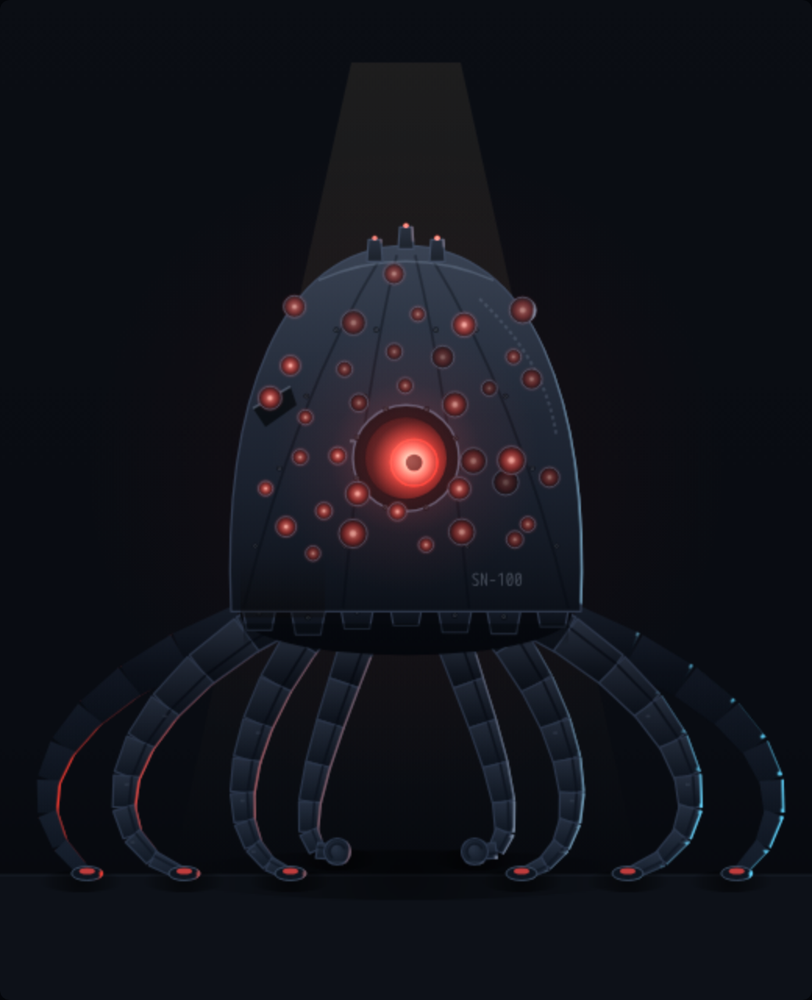
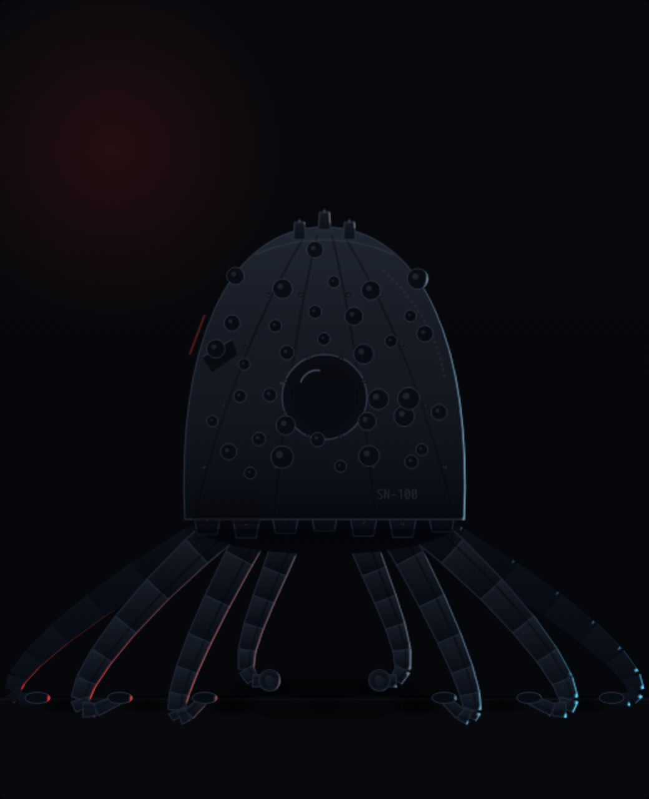

# sentinel — "ARGUS" (SN-100) · prototype A

Standing-look prototype for the **sentinel ops role** of crew#128. A **role
droid** like the leader: no vendor colour — the sentinel's palette is red,
full stop. Named for the hundred-eyed watchman.

Open `proto-a-argus.html` in a browser (working / idle / offline buttons
under the canvas; `?state=X&t=N` renders a deterministic still).

## The concept

An octopus-type frame: one armoured bell mantle **standing on its own
eight arms**, and the mantle is covered in eyes — the Matrix machine-mother
stare. The sentinel flags and never acts, so it has no hands and no tools;
it is a watcher all the way down.

- **One master optic** dead centre — heavy bolted bezel, iris ring, slow
  deliberate gaze in idle, locked forward when working.
- **~40 satellite optics** in rings around it, each with its own socket,
  clock and blink; when working a scan wave sweeps the field. Offline
  they are forty dead lenses that still catch the room light — worse.
- **Riveted petal mantle** — diving-bell armour with seam ribs, a dented
  petal, a weld bead, scorch rising from the skirt. Nothing soft.
- **Eight segmented hydraulic arms** splayed to the deck with suction
  pads gripping; the front pair curls under and it rests on the knuckles.
- **Offline it settles**: the arms flatten and splay, the bell sits low on
  its own skirt — a beached machine, beacon raking the petals.

Written in the fleet-floor grammar — canvas 2D, `plate()`/rim/emissive
buffers, no assets, no deps — so it ports into a `buildSentinel()` in
`fleet-floor/src/app.js` the way JUGGERNAUT ported into `buildKimi()`.

## Renders

| working | idle | offline |
|---|---|---|
|  |  |  |
