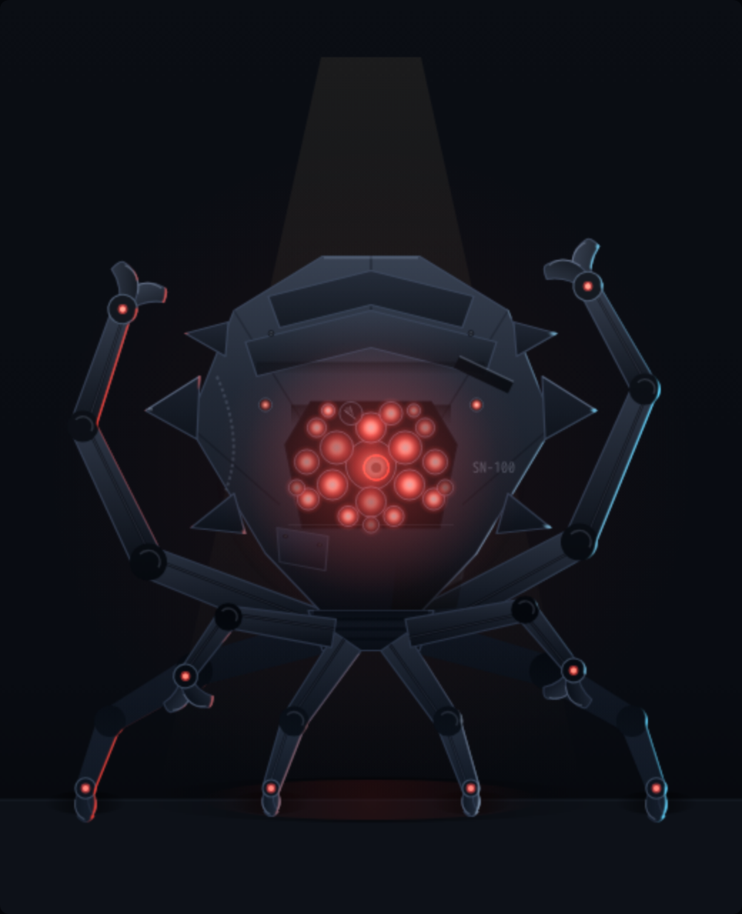

# sentinel — "ARGUS" (SN-100) · prototype B (war-form)

Standing-look prototype for the **sentinel ops role** of crew#128. A **role
droid** like the leader: no vendor colour — the sentinel's palette is red,
full stop. Named for the hundred-eyed watchman.

**Current: `proto-b-warform.html`** (working / idle / offline buttons under
the canvas; `?state=X&t=N` renders a deterministic still). `proto-a-argus.html`
is the first round — a smooth bell with eyes scattered politely — kept as
history; the operator's verdict on it was *soft, not scary, not dangerous*.

## The concept (B)

The Matrix-sentinel read of the role: an **angular hunched carapace standing
on jointed arms**, one packed cluster of red lenses for a face, and half its
arms held ready rather than standing. The sentinel flags and never acts —
but nothing about it should suggest that being flagged is pleasant.

- **The eyes are a CLUSTER** — one master lens with iris and pupil, ~20
  more packed lens-to-lens in a deep recessed face bowl: the
  machine-mother stare. A scan wave sweeps the cluster when working. One
  lens is **dead and cracked** and stays that way.
- **Faceted shield hull**, all hard edges: blade flanges and spurs off
  both shoulders (kept sharp, one tip chipped), chevron armour bands
  layered over the crown, aux lenses watching sideways, gouge, weld
  bead, patched facet, scorch climbing the jaw.
- **Eight jointed arms with hard elbows** — dark ball joints, piston
  channels, no soft curves. **Four are support**: splayed wide and
  planted, pincers closed and dug into the deck — it *stands* on them.
  **Four are weapons**: two raised past the hull with pincers open, two
  cocked mid-height, held off the deck so they never read as feet. Every
  arm ends in a **hooked two-fang pincer** with a red sensor at the hub.
- **Offline** the weapon arms drop and drag, every pincer closes, the
  hull settles onto its haunches — and twenty dead lenses still catch
  the room light, which is worse.

Written in the fleet-floor grammar — canvas 2D, `plate()`/rim/emissive
buffers, no assets, no deps — so it ports into a `buildSentinel()` in
`fleet-floor/src/app.js` the way JUGGERNAUT ported into `buildKimi()`.

## Renders — proto B

| working | idle | offline |
|---|---|---|
|  |  |  |

## Renders — proto A (superseded)

| working | idle | offline |
|---|---|---|
|  |  |  |
