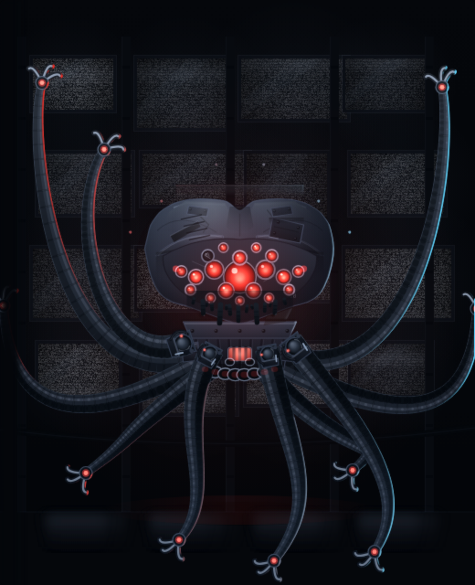
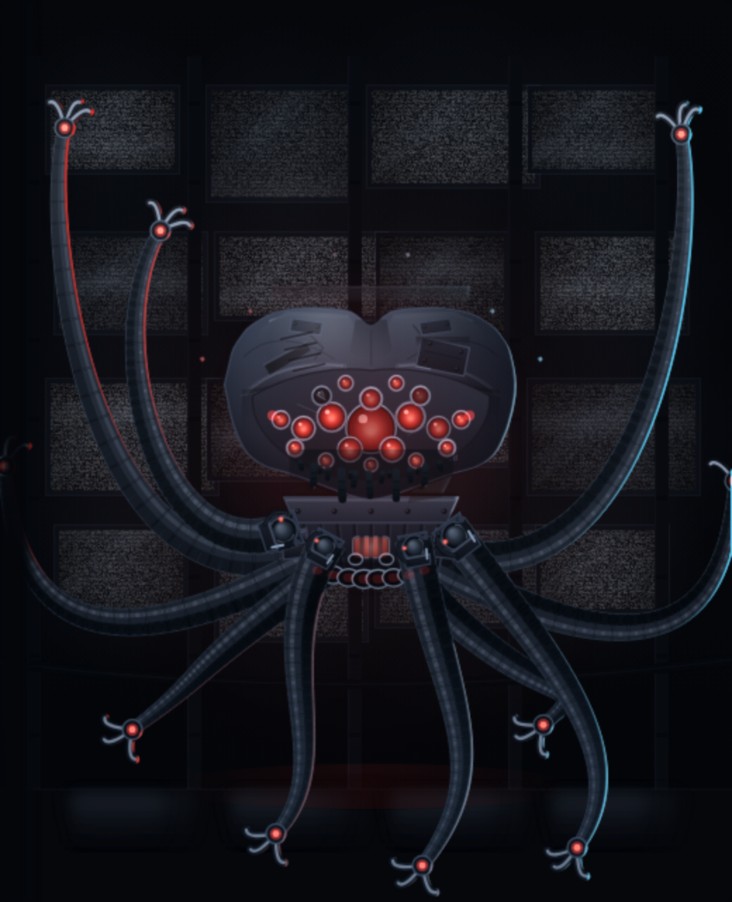
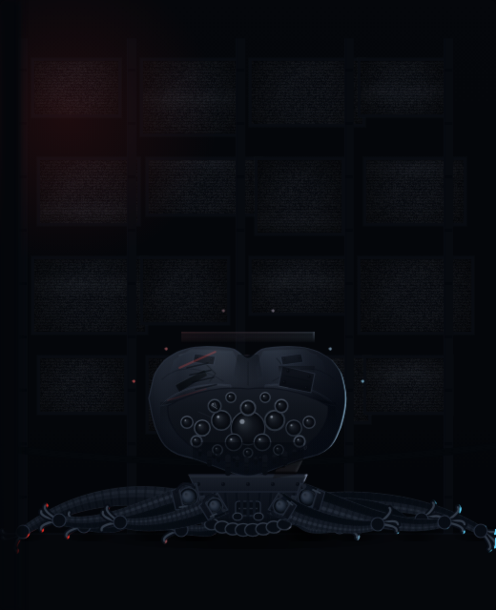
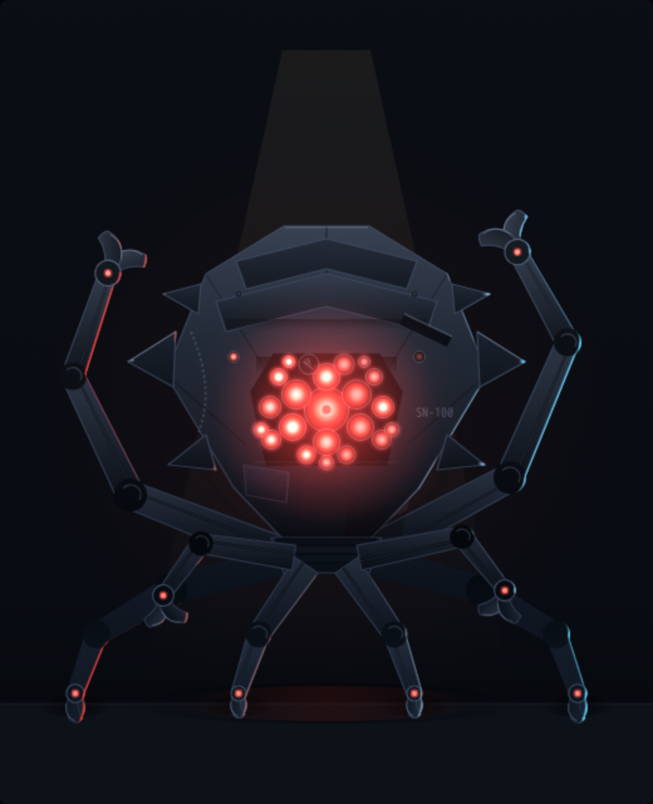
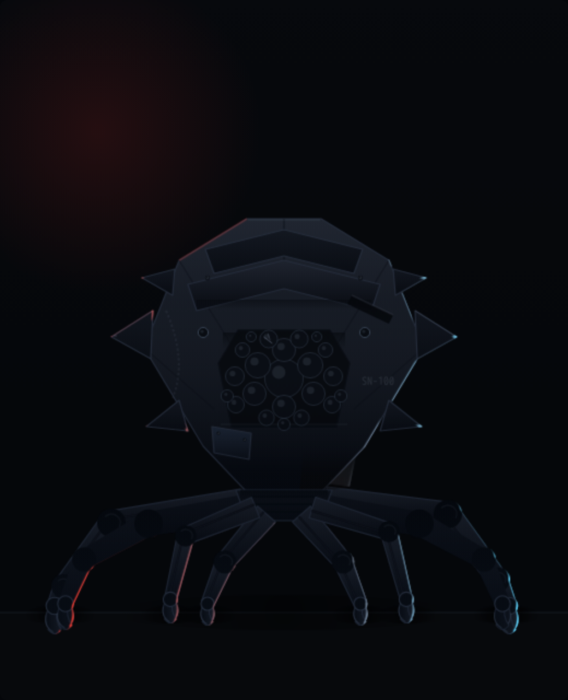
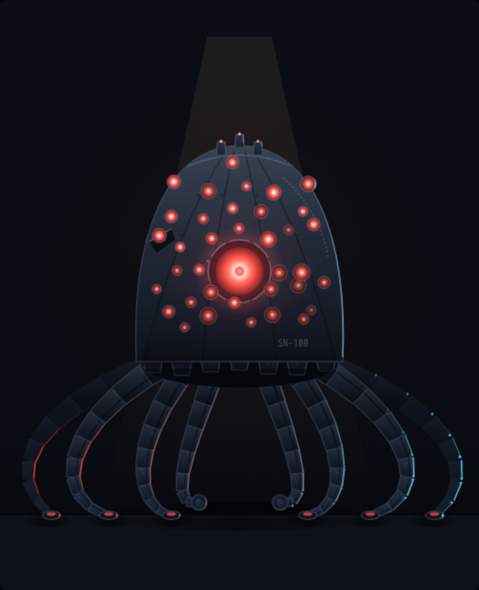

# sentinel — "SQUIDDY" (SN-100) · prototype C

Standing-look prototype for the **sentinel ops role** of crew#128. A **role
droid** like the leader: no vendor colour — the sentinel's palette is red,
full stop.

**Current: `proto-c-squiddy.html`** (working / idle / offline buttons under
the canvas; `?state=X&t=N` renders a deterministic still). Drawn against the
actual Matrix sentinel reference the operator supplied, then taken through
**ten render loops** — five structural, five detail — against
`~/pw-harness/droids.js`.

Two earlier rounds are kept as history: `proto-a-argus.html` (a smooth bell
— *soft, not scary*) and `proto-b-warform.html` (an angular crab shield —
*worse, not the movie shape*).

## The concept

**It flies.** Alive it hovers with nothing touching the deck, holding
station on a slow figure-of-eight drift, one soft shadow pooled far below.
Dead it is on the floor. (The earlier coil-stack "feet" are gone — a
sentinel that stands on furniture isn't a sentinel.)

- **A squared, wide, squat, symmetric skull.** Two round bumps over a
  notch read as a backside at any size, so the crown is cut like a
  machined casting: a narrow steep notch on the centre line, a nearly
  **flat plateau** across each hump, and a **hard shoulder corner** into
  the flank. Corners are filleted with small radii up top so they stay
  crisp, and generous radii round the chin where the casting really is
  round.
- **The base shape.** The shape comes from danmt's blue
  overlay on PR #230 — traced out of the screenshot pixel by pixel and
  mapped into canvas space through the eye cluster (kept as `TARGET` /
  `target-outline.json`; render with `?outline=1` to see it). But the
  trace is the *intent*, not the geometry: a freehand line is asymmetric,
  and shipping that wobble literally was its own mistake. So the head is
  authored as a symmetric **half-profile, mirrored** — `HALF[]` in the
  source — pulled wider and flatter than the trace, with the saddle dip
  cut to about a third of what the trace showed. ~202 x 124.
- **The head stays at 1:1 and is the small end of the unit.** The whips
  are the mass and own the frame. They are drawn as real **tapered tubes**
  — a body polygon down both offsets of the spine, lit crown, shadowed
  belly, cross-stroke ribs — because at this gauge a row of ellipses
  stops overlapping cleanly and the limb comes out scalloped like a
  feather.
- **The root hub is an assembly, not a plinth**: an armoured collar under
  the chin, a ribbed drum with a caged lit core, outboard mount ears,
  slung hoses and bolts.
- **Front limbs are mounted in the open; back limbs are not.** The same
  division codex uses for its legs. Eight whips run out from *behind* the
  hull with the hub covering where they meet it — no attachment to sell.
  The **four in front** each get a real mechanism: a bolted mount plate,
  a dark socket cup with a **ball joint** and its lit crescent, a clamp
  collar biting the limb's first segment, a stub ram (sleeve, then
  polished rod) and a feed line off the drum. The mount is drawn *after*
  its limb so it visibly clamps it. Eight sockets along the drum's lower
  edge account for the back limbs.
- **Nothing under the chin reads as a mouth.** Tapered spikes along a jaw
  line are teeth, and lit edges on them are a grin. What hangs there is a
  cluster of short matte manipulator stubs at mixed depths and gauges,
  with no highlight on any of them, sitting in their own shadow.
- **Volume, not a mask**: one modelling pass clipped to the silhouette
  puts the highlight on the left-of-centre crown and drives a terminator
  down the right flank, so the head turns away from the light at its own
  edges instead of sitting flat.
- **Fifteen glossy red berry-eyes in chrome sockets**, different sizes,
  packed across a deep recessed face bowl. Each has its own glint,
  shimmer clock and socket polish; a scan wave sweeps them when working.
  One is **dead and cracked**. Offline they all go to dead glass and keep
  their glints — worse.
- **A fringe of tapered mandible fangs** under the jaw, curling inward,
  each on its own twitch clock, each with a lit honed edge.
- **Machine surface**: louvre bank on the left lobe, bolted inspection
  hatch on the right, panel lines crossing the seams, rivets, seam
  cracks, a crown gouge, cheek scorch.
- **A dozen ribbed whips** — lit crown, shadowed belly — S-curving in
  every direction, tipped with three-prong grapple claws with red sensor
  hubs. One thrown high past the skull, one reaching forward-down.
- **Offline**: the hull drops to the deck, every whip crumples at its own
  height and folds back on itself, the grapples close, and the service
  beacon rakes the lobe arris and the brow lip.

Written in the fleet-floor grammar — canvas 2D, `plate()`/rim/emissive
buffers, no assets, no deps — so it ports into a `buildSentinel()` in
`fleet-floor/src/app.js` the way JUGGERNAUT ported into `buildKimi()`.

## The room — the static gallery

A dead monitoring room: sixteen screens on rack uprights, **every one of them
showing snow**. Each has its own roll speed, phase and drift, so the wall
never reads as tiled wallpaper — plus a sweeping roll bar, scanlines, tube
vignetting and a raking glass highlight per screen, and each throws its own
weak light into the room. The deck returns them as blurred vertical smears.
Nothing in here is being watched by anyone but the sentinel.

## Renders — proto C

| working | idle | offline |
|---|---|---|
|  |  |  |

## Prior rounds (superseded)

| B working | B offline | A working |
|---|---|---|
|  |  |  |
